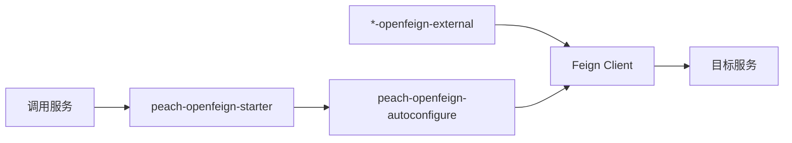

# peach-openfeign

[English](README.en-US.md) | 中文

`peach-openfeign` 是 Peach Cloud 的服务间 HTTP 调用治理 Starter，统一 Same-Token、RequestId、超时、有限重试、Sentinel 与异常边界。业务 Feign 契约仍由各业务 `*-openfeign-external` 模块维护。

## 结构

| 模块 | 职责 |
| --- | --- |
| `peach-openfeign-autoconfigure` | 拦截器、超时/重试、异常治理、Sentinel 和自动配置 |
| `peach-openfeign-starter` | 业务接入依赖入口 |
| `peach-openfeign-quickstart` | 最小治理自动装配验证，不复制业务 API |

Quickstart：[`peach-openfeign-quickstart`](peach-openfeign-quickstart/README.md)。

## 边界

- 仅传播项目约定的 Same-Token 与 RequestId，不把任意业务 Header 变成默认透传。
- 重试只用于明确可恢复且可安全重试的调用；写请求不能默认盲目重试。
- Sentinel 负责调用治理，但业务 fallback 数据语义由调用方决定。
- 大文件传输优先使用对象存储等专用通道，不依赖 Feign 作为无限中转层。
