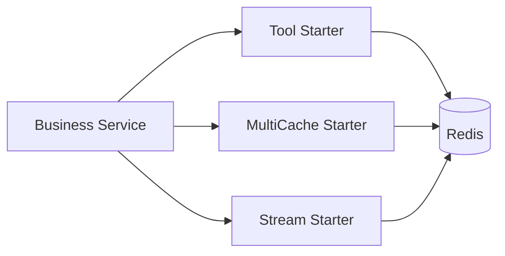

# peach-redis

English | [中文](README.md)

`peach-redis` separates Redis capabilities into three independent starters: tools, multi-level cache and Stream. Stable shared contracts live in `peach-redis-common`.

## Structure

| Capability | Autoconfigure | Starter | Quickstart |
| --- | --- | --- | --- |
| Tool | `peach-redis-tool-autoconfigure` | `peach-redis-tool-starter` | `peach-redis-tool-quickstart` |
| MultiCache | `peach-redis-multicache-autoconfigure` | `peach-redis-multicache-starter` | `peach-redis-multicache-quickstart` |
| Stream | `peach-redis-stream-autoconfigure` | `peach-redis-stream-starter` | `peach-redis-stream-quickstart` |

## Selection

- General Redis access: `peach-redis-tool-starter`.
- Local + Redis multi-level caching: `peach-redis-multicache-starter`.
- Redis Stream producer/consumer integration: `peach-redis-stream-starter`.

## Quick Start

Each capability ships a non-web quickstart (`spring.main.web-application-type=none`) that depends on the matching starter plus `peach-redis-common`, and verifies the minimal loop with Testcontainers Redis (`redis:7.2-alpine`). Provide a development Redis for local demos, or run the IT suite directly.

### Tool

- Module: [`peach-redis-tool-quickstart`](./peach-redis-tool-quickstart/)
- Capability samples (inject `RedisDao`):
  - **String + TTL**: session token save / get / exists / delete
  - **Hash**: user profile write-all, field get, field delete
  - **Set**: user tags add / list / remove
- `RedisToolDemoRunner` runs the demos on startup; disable with `quickstart.redis-tool.demo.enabled=false`
- Run: `mvn -f peach-middleware/peach-redis/peach-redis-tool-quickstart/pom.xml spring-boot:run`
- Test: `mvn -f peach-middleware/peach-redis/peach-redis-tool-quickstart/pom.xml test`

### MultiCache

- Module: [`peach-redis-multicache-quickstart`](./peach-redis-multicache-quickstart/)
- Capability samples (product-detail scenario, two access styles):
  - **CacheManager**: inject the auto-configured `CacheManager`, then explicit `put/get`, miss → load, `evict` then reload
  - **Layered proof**: clear L1 (Caffeine) only, still hit L2 (Redis), refill local, and skip the store
  - **Annotation**: `@EnableCaching` + `@Cacheable` / `@CacheEvict` on the same `CacheManager`
- `MulticacheDemoRunner` runs the demos on startup; tests use `InMemoryProductStore#loadCount` and `clearLocal` to prove the hit path
- Minimal config: `peach.multicache.enabled=true`, `peach.multicache.cache-names` (`product-manager` / `product-annotation`), plus `peach.redis.*`
- Run: `mvn -f peach-middleware/peach-redis/peach-redis-multicache-quickstart/pom.xml spring-boot:run`
- Test: `mvn -f peach-middleware/peach-redis/peach-redis-multicache-quickstart/pom.xml test`
- Disable startup demo: `quickstart.multicache.demo.enabled=false`

### Stream

- Module: [`peach-redis-stream-quickstart`](./peach-redis-stream-quickstart/)
- Capability samples (order-status stream):
  - **Push + Consume**: `RedisStreamPushHandler#push` returns `RecordId`; implement `MessageConsumer` to confirm consume
  - **Idempotency**: replay the same `RecordId` and skip duplicates in business code (accepted=1 / duplicate=1)
- `RedisStreamDemoRunner` runs on startup; disable with `quickstart.stream.demo.enabled=false`
- Minimal config: `peach.redis.stream.enable=true` (`consumer-type=group`), plus `peach.redis.*`
- Run: `mvn -f peach-middleware/peach-redis/peach-redis-stream-quickstart/pom.xml spring-boot:run`
- Test: `mvn -f peach-middleware/peach-redis/peach-redis-stream-quickstart/pom.xml test`

`peach.redis.host` uses `host:port`. Quickstarts share defaults: `password=${PEACH_REDIS_PASSWORD:123456}`, `database=1` (override via env vars).

## Boundaries

- Keys need stable namespaces and required isolation dimensions; sensitive values must not be placed directly in keys/logs.
- Caches define TTL, invalidation, fallback and consistency semantics.
- Stream consumers require business idempotency plus explicit ACK, retry, backlog and failure governance.
- Pub/Sub, Stream and caches must not be documented as strong consistency or Exactly-Once guarantees.
