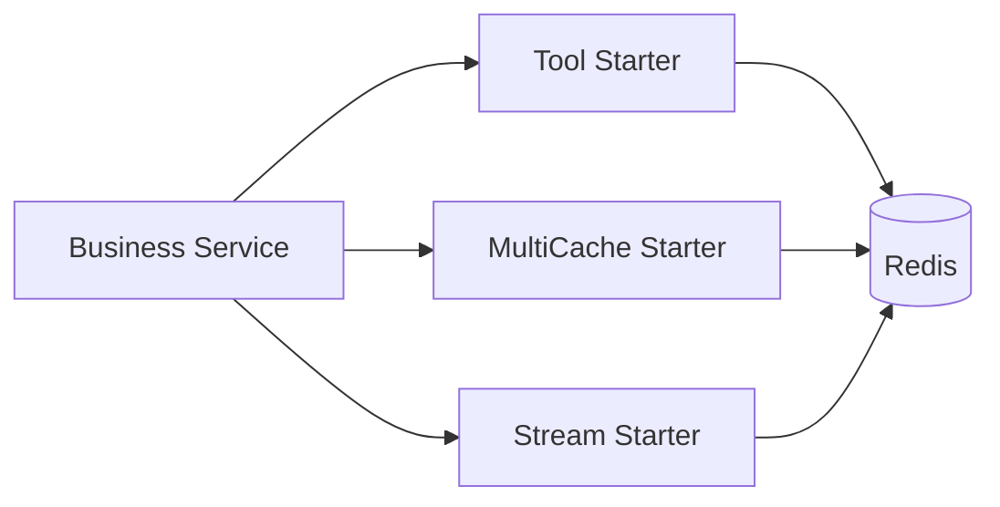

# peach-redis

English | [中文](README.md)

`peach-redis` separates Redis capabilities into three independent starters: tools, multi-level cache and Stream. Stable shared contracts live in `peach-redis-common`.

## Structure

| Capability | Autoconfigure | Starter | Quickstart |
| --- | --- | --- | --- |
| Tool | `peach-redis-tool-autoconfigure` | `peach-redis-tool-starter` | `peach-redis-tool-quickstart` |
| MultiCache | `peach-redis-multicache-autoconfigure` | `peach-redis-multicache-starter` | `peach-redis-multicache-quickstart` |
| Stream | `peach-redis-stream-autoconfigure` | `peach-redis-stream-starter` | `peach-redis-stream-quickstart` |

## Selection

- General Redis access: `peach-redis-tool-starter`.
- Local + Redis multi-level caching: `peach-redis-multicache-starter`.
- Redis Stream producer/consumer integration: `peach-redis-stream-starter`.

The matching quickstarts are integration verification only and require a development Redis instance.

## Boundaries

- Keys need stable namespaces and required isolation dimensions; sensitive values must not be placed directly in keys/logs.
- Caches define TTL, invalidation, fallback and consistency semantics.
- Stream consumers require business idempotency plus explicit ACK, retry, backlog and failure governance.
- Pub/Sub, Stream and caches must not be documented as strong consistency or Exactly-Once guarantees.
