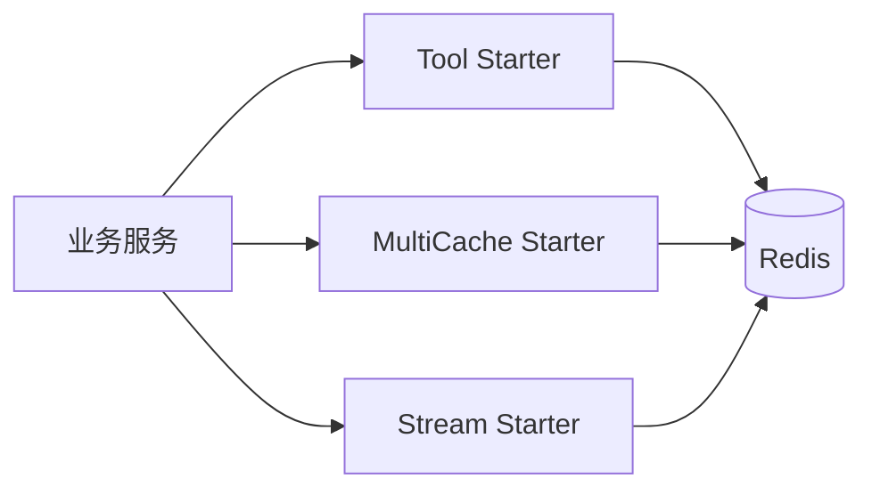

# peach-redis

[English](README.en-US.md) | 中文

`peach-redis` 将 Redis 能力拆成三个独立 Starter：基础工具、多级缓存和 Stream。共享稳定契约放在 `peach-redis-common`。

## 结构

| 能力 | Autoconfigure | Starter | Quickstart |
| --- | --- | --- | --- |
| Tool | `peach-redis-tool-autoconfigure` | `peach-redis-tool-starter` | `peach-redis-tool-quickstart` |
| MultiCache | `peach-redis-multicache-autoconfigure` | `peach-redis-multicache-starter` | `peach-redis-multicache-quickstart` |
| Stream | `peach-redis-stream-autoconfigure` | `peach-redis-stream-starter` | `peach-redis-stream-quickstart` |

## 选择

- 通用 Redis 访问：`peach-redis-tool-starter`。
- 本地 + Redis 多级缓存：`peach-redis-multicache-starter`。
- Redis Stream 消费/生产：`peach-redis-stream-starter`。

对应 quickstart 仅用于接入验证，运行前提供开发 Redis。

## 边界

- key 必须有稳定命名空间和必要隔离维度，敏感值不直接进入 key/log。
- 缓存必须明确 TTL、失效、回源和一致性策略。
- Stream 消费必须业务幂等，并明确 ACK、重试、积压和失败治理。
- Pub/Sub、Stream 和缓存都不能被文档包装成强一致或 Exactly-Once。
