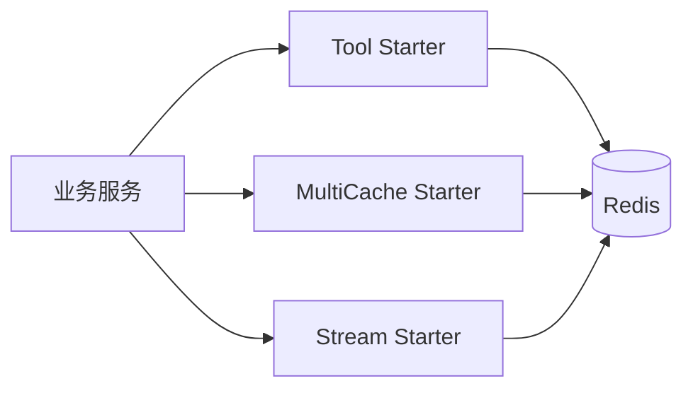

# peach-redis

[English](README.en-US.md) | 中文

`peach-redis` 将 Redis 能力拆成三个独立 Starter：基础工具、多级缓存和 Stream。共享稳定契约放在 `peach-redis-common`。

## 结构

| 能力 | Autoconfigure | Starter | Quickstart |
| --- | --- | --- | --- |
| Tool | `peach-redis-tool-autoconfigure` | `peach-redis-tool-starter` | `peach-redis-tool-quickstart` |
| MultiCache | `peach-redis-multicache-autoconfigure` | `peach-redis-multicache-starter` | `peach-redis-multicache-quickstart` |
| Stream | `peach-redis-stream-autoconfigure` | `peach-redis-stream-starter` | `peach-redis-stream-quickstart` |

## 选择

- 通用 Redis 访问：`peach-redis-tool-starter`。
- 本地 + Redis 多级缓存：`peach-redis-multicache-starter`。
- Redis Stream 消费/生产：`peach-redis-stream-starter`。

## Quick Start

各能力均提供无 Web 端口的 quickstart（`spring.main.web-application-type=none`），依赖对应 starter + `peach-redis-common`，并通过 Testcontainers Redis（`redis:7.2-alpine`）做最小闭环验证。本地演示前提供开发 Redis，或直接跑 IT。

### Tool

- 模块：[`peach-redis-tool-quickstart`](./peach-redis-tool-quickstart/)
- 能力样例（注入 `RedisDao`）：
  - **String + TTL**：会话 token 写入 / 读取 / 存在判断 / 删除
  - **Hash**：用户资料批量写入、按字段读取与字段删除
  - **Set**：用户标签添加 / 列表 / 移除
- 启动后 `RedisToolDemoRunner` 依次执行；关闭演示：`quickstart.redis-tool.demo.enabled=false`
- 运行：`mvn -f peach-middleware/peach-redis/peach-redis-tool-quickstart/pom.xml spring-boot:run`
- 测试：`mvn -f peach-middleware/peach-redis/peach-redis-tool-quickstart/pom.xml test`

### MultiCache

- 模块：[`peach-redis-multicache-quickstart`](./peach-redis-multicache-quickstart/)
- 能力样例（商品详情场景，两种接入方式）：
  - **CacheManager**：注入自动装配的 `CacheManager`，显式 `put/get`、未命中回源、`evict` 后再次回源
  - **分层证明**：仅清 L1(Caffeine) 后仍命中 L2(Redis) 并回填本地，且不回源
  - **注解**：`@EnableCaching` + `@Cacheable` / `@CacheEvict`，同样走该 `CacheManager`
- 启动后 `MulticacheDemoRunner` 依次跑上述演示；测试用 `InMemoryProductStore#loadCount` 与 `clearLocal` 证明命中路径
- 最小配置：`peach.multicache.enabled=true`、`peach.multicache.cache-names`（`product-manager` / `product-annotation`），以及 `peach.redis.*`
- 运行：`mvn -f peach-middleware/peach-redis/peach-redis-multicache-quickstart/pom.xml spring-boot:run`
- 测试：`mvn -f peach-middleware/peach-redis/peach-redis-multicache-quickstart/pom.xml test`
- 关闭启动演示：`quickstart.multicache.demo.enabled=false`

### Stream

- 模块：[`peach-redis-stream-quickstart`](./peach-redis-stream-quickstart/)
- 能力样例（订单状态流）：
  - **Push + Consume**：`RedisStreamPushHandler#push` 拿 `RecordId`，业务实现 `MessageConsumer` 消费确认
  - **幂等**：同一 `RecordId` 回放时业务侧去重（accepted=1 / duplicate=1）
- 启动后 `RedisStreamDemoRunner` 执行；关闭演示：`quickstart.stream.demo.enabled=false`
- 最小配置：`peach.redis.stream.enable=true`（`consumer-type=group`），以及 `peach.redis.*`
- 运行：`mvn -f peach-middleware/peach-redis/peach-redis-stream-quickstart/pom.xml spring-boot:run`
- 测试：`mvn -f peach-middleware/peach-redis/peach-redis-stream-quickstart/pom.xml test`

`peach.redis.host` 格式为 `host:port`。Quickstart 统一默认：`password=${PEACH_REDIS_PASSWORD:123456}`、`database=1`（可用环境变量覆盖）。

## 边界

- key 必须有稳定命名空间和必要隔离维度，敏感值不直接进入 key/log。
- 缓存必须明确 TTL、失效、回源和一致性策略。
- Stream 消费必须业务幂等，并明确 ACK、重试、积压和失败治理。
- Pub/Sub、Stream 和缓存都不能被文档包装成强一致或 Exactly-Once。
