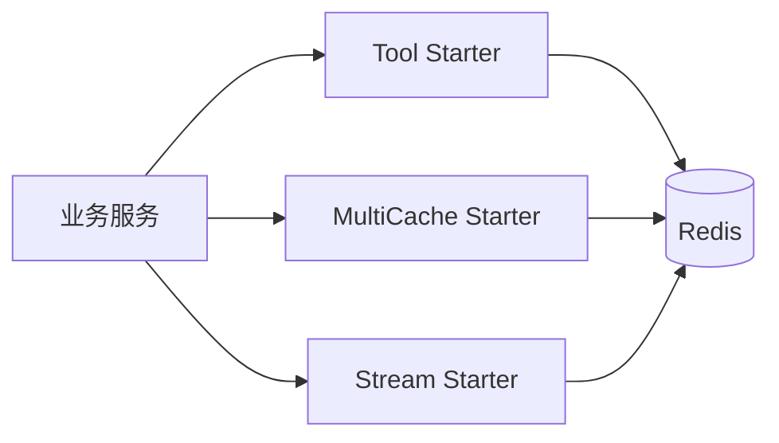

# peach-redis

[English](README.en-US.md) | 中文

`peach-redis` 通过独立 `peach-redis-starter` 提供 Jedis / Spring Data Redis 连接底座，并按需提供 Tool、多级缓存和 Stream 三个能力 Starter。历史 `peach-redis-common` 仅保留为外部旧应用兼容与回滚工件；仓库内部 Maven 模块已不再直接依赖它。

## 组件定位与版本

**面向谁：** 需要 Redis 数据结构操作、应用级 L1 + Redis L2 缓存或 Redis Stream 消息能力的 Spring Boot 业务服务。这里的 `peach-redis` 是 Maven 聚合模块，不是将全部能力打包的单个依赖。按需要选用对应 Starter，避免将 Stream、缓存和通用 DAO 一并接入。

**当前基线：** Java 21 / Spring Boot 3.5.4；旧 `peach-redis-common` 仍兼容提供 Jedis、模板和 RedissonClient；需要单独 Redisson 的新服务现可通过 `peach-redisson-starter` 接入，不依赖旧 Redis Common。仓库内部客户端依赖迁移已完成，旧兼容工件退役与线上滚动验收仍待完成。以下表格描述 **main 当前已存在的功能**，并标明关键运行约束；后续解耦计划见 [Issue #18](https://github.com/Ryan-Guizhou/peach-cloud/issues/18)。

## ACL、Sentinel 与 Cluster 配置契约（Issue #49）

独立 `peach-redis-starter` 同时支持数据节点 ACL 和独立 Sentinel ACL；两类认证信息不应混用。下列键在未配置时保持兼容默认值：

| 配置项 | 默认值 | 说明 |
| --- | --- | --- |
| `peach.redis.username` | 空 | Redis 数据节点用户名，Standalone / Sentinel / Cluster 均适用 |
| `peach.redis.password` | 空 | Redis 数据节点密码 |
| `peach.redis.sentinel-username` | 空 | Sentinel 自身的 ACL 用户名，可与数据节点不同 |
| `peach.redis.sentinel-password` | 空 | Sentinel 自身的密码 |
| `peach.redis.ssl-enabled` | `false` | Jedis SSL/TLS 开关；与 Redisson 的 `ssl-enable` 独立 |
| `peach.redis.jedis.max-total` | `128` | Jedis 连接池最大连接数 |

Redis Cluster 只支持数据库 `0`，非法值启动时直接失败。两份 Nacos 模板使用相同配置键；密码应在安全配置源维护，不能提交真实凭据。应用自定义 `RedisConnectionFactory` 仍优先于默认 Jedis 工厂。具体多拓扑执行方式见下方 Issue #47 验收章节。

## 完整能力矩阵

| 模块 / Starter | 核心入口 | 能做什么 | 典型场景 | 当前限制 / 注意事项 |
| --- | --- | --- | --- | --- |
| 连接底座 / `peach-redis-starter`（推荐） | `RedisConnectionFactory`、`RedisTemplate`、`StringRedisTemplate` | 独立 Jedis、Standalone/Sentinel/Cluster、TLS、ACL、连接池、自定义工厂退让 | Sa-Token / Tool / 缓存 / Stream | 不创建 `RedissonClient`；Cluster 仅数据库 0；保留旧序列化格式，旧会话滚动兼容待验证 |
| 旧混合组件 / `peach-redis-common`（仅兼容） | `RedisConfig` | 旧版 Jedis + Redisson 混合装配 | 存量应用回滚 | 仓库内部不再直接依赖；新服务不要引入，外部旧应用迁移后才能退役 |
| `peach-redis-tool-starter` | `RedisDao` | String、TTL、Hash、List、Set、ZSet、Pub/Sub 和批量删除 | 会话辅助数据、计数、业务 KV、标签 | `scan()` 支持单机/Sentinel 与按 master 扫描 Cluster；`count` 仅为扫描批次提示，结果累计占内存且非一致快照；跨槽删除逐键执行 |
| `peach-redis-multicache-starter` | `MultiCacheManager`、`MultiCacheManagerService`、Spring Cache | Caffeine L1 + Redis L2、TTL 抖动、CacheManager/注解接入、Pub/Sub 失效广播 | 商品详情、相对稳定的配置/字典缓存 | Pub/Sub 是尽力失效而非强一致；`clear()` 使用已恢复的 Redis SCAN，但大范围扫描仍存在内存与一致性限制；Caffeine STRONG 引用已修复，跨实例无强一致保证 |
| `peach-redis-stream-starter` | `RedisStreamPushHandler`、`RedisStreamHandler`、`MessageConsumer` | Stream 生产、group/broadcast 消费、消费者回调 | 轻量业务消息、事件处理 | 消费组仅在业务成功后显式 ACK；失败保留 PEL；可选定时认领、指数退避及 DLQ（默认关闭，仍需故障注入） |

### 如何选择

- **批量查找与清理：** `RedisDao#scan` / `deletePattern` 会遍历全部匹配键；`COUNT` 只是 Redis 的遍历提示，不能保证返回量或一致快照；建议离线、低频使用，并避免非常大的键空间。
- **仅缓存键值、结构化数据：** 使用 Tool。原生 `RedisTemplate` 可直接满足的场景无需再次封装 DAO。
- **Caffeine L1 选项：** 默认强引用，显式 `WEAK` 会改变缓存键的引用匹配行为；`putIfAbsent` 使用 Redis 原子 SET NX，而跨节点失效仍依赖尽力而为的 Pub/Sub。
- **需要本地缓存加速：** 使用 MultiCache，并接受短暂陈旧、设置合理 TTL；安全相关实时授权不要仅依赖本地缓存。
- **需要消息消费：** 使用 Stream；当前版本应自行保证业务幂等及失败恢复，不能视为可靠投递的完整替代方案。
- **需要锁、布隆过滤器、延迟队列、防重复：** 转到 [peach-redission](../peach-redission/README.md)，不要把该能力误归入 Redis Tool。
- **Gateway：** 使用独立响应式 Lettuce；不要通过 Redis Tool 为 WebFlux 事件循环引入阻塞调用。

### 最简依赖（当前版本）

```xml
<dependency>
    <groupId>com.peach</groupId>
    <artifactId>peach-redis-tool-starter</artifactId>
    <version>${revision}</version>
</dependency>
```

`revision` 来自 peach-cloud Maven reactor；脱离 reactor 时换为发布的具体版本。Tool / MultiCache / Stream Starter 已透传独立 `peach-redis-starter`，三个能力 Quickstart 不再显式依赖旧 `peach-redis-common`；生产部署仍需对 Nacos 和历史数据进行兼容性回归。

### 最简配置（当前项目约定）

```yaml
peach:
  redis:
    mode: standalone
    host: "${REDIS_HOST:127.0.0.1:6379}"
    password: "${REDIS_PASSWORD:}"
    database: 0
```

此示例使用开发环境占位信息；生产环境凭据应来自安全配置源。当前拓扑字段是 `peach.redis.*` 而非 `spring.data.redis.*`。多级缓存需额外配置 `peach.multicache.*`，Stream 的启用项是 **`peach.redis.stream.enable`**（不是 `enabled`）。

### 代码示例（Tool）

```java
@Service
@RequiredArgsConstructor
public class ProfileCacheService {
    private final RedisDao redisDao;

    public void cache(String userId, String value) {
        redisDao.vSet("profile:" + userId, value, java.time.Duration.ofMinutes(5));
    }

    public Object find(String userId) {
        return redisDao.vGet("profile:" + userId);
    }
}
```

以上通过已有 `RedisDao` API 演示。建议生产中统一 key 命名、TTL 和故障策略，且避免在 key 或日志中写入个人敏感信息。

### 故障与兼容约定

| 情况 | 处理原则 |
| --- | --- |
| Redis 不可达 | 缓存可按业务回源；凭证、鉴权、验证码等关键路径不应放行 |
| 多级缓存失效订阅掉线 | 本地值可能陈旧，限制 L1 TTL，重连清理和跨实例一致性仍待完善 |
| Stream 处理异常 | group 模式失败消息留在 PEL；可选的 XPENDING/XCLAIM 定时恢复、退避及 DLQ 默认关闭，启用前必须完成业务持久幂等和故障注入验收 |
| 更换 Jackson/客户端 | 先验证旧 Redis JSON 与存量 key 可读，不可直接变更会话协议 |


## 业务依赖迁移进展（Issue #41）

- **Sa-Token**：autoconfigure 通过 `RedisConnectionFactory` 接入；Starter 传递 `peach-redis-starter`，不再直接携带旧 `peach-redis-common`；原有 Sa-Token JSON/Key 规则保持不变。
- **Captcha**：autoconfigure 只声明可选的 Spring Data Redis、Hutool 编译依赖，内存缓存实现仍可独立使用。
- **Auth / Setting / Message**：业务模块改为独立 Redis Starter；Auth 启动模块移除能由 Starter 传递的旧 Jedis、Redisson 和 Spring Data Redis 直连依赖。
- **未完成验收**：现有 Redis key 与会话数据读写、登录/退出、网关的响应式 Lettuce 隔离、Nacos 部署模板和 Sentinel/Cluster/TLS 迁移必须在目标环境单独验收。旧 `peach-redis-common` 不会在本批直接删除。

## 旧客户端依赖收敛（Issue #43）

Redis Tool / MultiCache / Stream 的 autoconfigure 与 Quickstart POM 已移除旧 `peach-redis-common` 可选及直接依赖；`RedisDaoImpl` 的 Cluster 判断使用模块内常量，不再从旧 RedisConfig 模块取值。Redisson Common / Bloom / DistributedLock / DelayQueue 的历史可选依赖也已清理。独立 Starter 在 Redis 7.2 真实服务容器执行基础客户端及 Tool 的测试，均须通过后合并；生产 Redis 数据、配置与会话的跨版本滚动升级仍需单独验收。

## 结构

| 能力 | Autoconfigure | Starter | Quickstart |
| --- | --- | --- | --- |
| Tool | `peach-redis-tool-autoconfigure` | `peach-redis-tool-starter` | `peach-redis-tool-quickstart` |
| MultiCache | `peach-redis-multicache-autoconfigure` | `peach-redis-multicache-starter` | `peach-redis-multicache-quickstart` |
| Stream | `peach-redis-stream-autoconfigure` | `peach-redis-stream-starter` | `peach-redis-stream-quickstart` |


```mermaid
flowchart LR
    App[业务服务] --> Tool[Tool Starter]
    App --> Cache[MultiCache Starter]
    App --> Stream[Stream Starter]
    Tool --> Redis[(Redis)]
    Cache --> Redis
    Stream --> Redis
```

## 选择

- 通用 Redis 访问：`peach-redis-tool-starter`。
- 本地 + Redis 多级缓存：`peach-redis-multicache-starter`。
- Redis Stream 消费/生产：`peach-redis-stream-starter`。

## Quick Start

各能力均提供无 Web 端口的 quickstart（`spring.main.web-application-type=none`），只需对应 Starter 的依赖闭包。传统 Testcontainers 测试在缺少 Docker 环境时可能跳过，另有专用 Redis 7.2 服务容器 CI 实际运行 Tool 和客户端验收。本地演示前提供开发 Redis，或直接跑 IT。

### Tool

- 模块：[`peach-redis-tool-quickstart`](./peach-redis-tool-quickstart/)
- 能力样例（注入 `RedisDao`）：
  - **String + TTL**：会话 token 写入 / 读取 / 存在判断 / 删除
  - **Hash**：用户资料批量写入、按字段读取与字段删除
  - **Set**：用户标签添加 / 列表 / 移除
- 启动后 `RedisToolDemoRunner` 依次执行；关闭演示：`quickstart.redis-tool.demo.enabled=false`
- 运行：`mvn -pl peach-middleware/peach-redis/peach-redis-tool-quickstart -am spring-boot:run`
- 测试：`mvn -pl peach-middleware/peach-redis/peach-redis-tool-quickstart -am test`

### MultiCache

- 模块：[`peach-redis-multicache-quickstart`](./peach-redis-multicache-quickstart/)
- 能力样例（商品详情场景，两种接入方式）：
  - **CacheManager**：注入自动装配的 `CacheManager`，显式 `put/get`、未命中回源、`evict` 后再次回源
  - **分层证明**：仅清 L1(Caffeine) 后仍命中 L2(Redis) 并回填本地，且不回源
  - **注解**：`@EnableCaching` + `@Cacheable` / `@CacheEvict`，同样走该 `CacheManager`
- 启动后 `MulticacheDemoRunner` 依次跑上述演示；测试用 `InMemoryProductStore#loadCount` 与 `clearLocal` 证明命中路径
- 最小配置：`peach.multicache.enabled=true`、`peach.multicache.cache-names`（`product-manager` / `product-annotation`），以及 `peach.redis.*`
- 运行：`mvn -pl peach-middleware/peach-redis/peach-redis-multicache-quickstart -am spring-boot:run`
- 测试：`mvn -pl peach-middleware/peach-redis/peach-redis-multicache-quickstart -am test`
- 关闭启动演示：`quickstart.multicache.demo.enabled=false`

### Stream

### Pending 恢复与 DLQ（Issue #37）

**真实 Redis 7.2 恢复验收（Issue #51）：** 已在 Redis 服务容器新增 `RedisStreamRecoveryServerIntegrationTest`：验证 abandoned consumer 的 PEL 经 `XPENDING/XCLAIM` 被认领、回调成功后 `XACK`；业务异常仍保留 PEL；重试次数耗尽时先把 `sourceId/sourceStream/sourceGroup` 写入 DLQ，再确认源消息。CI 会检查 3 项测试真实执行、无跳过/失败。默认关闭的配置未改变。此测试不证明 Redis 主从切换时的幂等与跨键原子性，也不提供运维重放接口。

- **默认关闭**：设置 `peach.redis.stream.recovery.enabled=true` 开启；仅适用于 Consumer Group。启用之前必须让业务消费者按消息 ID 或业务主键实现持久幂等。广播模式不支持恢复。
- **恢复算法**：单线程定时以 `XPENDING` 分页读取，每次不超过 `batch-size`，然后以 `XCLAIM` 认领超过动态空闲阈值的记录；重试间隔按投递次数指数递增（`min-idle` 到 `max-retry-delay`）。业务处理成功后 XACK。
- **死信路径**：当投递次数达到 `max-attempts`，把原 RecordId、来源、投递次数与载荷写入独立 DLQ Stream；写入确认后才 XACK 源记录。默认 DLQ 名为 `源流名:dlq`。DLQ 与源流非跨键原子提交，崩溃时可能重复写死信，必须按 `sourceId` 去重。
- **验收边界**：当前是至少一次语义，仍需故障注入、Redis 主从切换、Cluster 验证、人工重放接口与观测告警完善；不要宣称 exactly-once 或强一致恢复。客户端重启不会清空 PEL。

```yaml
peach:
  redis:
    stream:
      enable: true
      consumer-type: group
      recovery:
        enabled: true
        batch-size: 32
        max-attempts: 5
        min-idle: 60s
        max-retry-delay: 15m
        interval: 30s
        # dead-letter-stream: order-status:dlq
```


**确认与恢复边界**：Consumer Group 使用手动 XACK：业务回调成功才确认，失败保留 PEL。每个服务实例的消费者名称带随机后缀；线程池由 Spring 管理。可选 `XPENDING`/`XCLAIM` 自动认领、退避与 DLQ 已实现但默认关闭；跨键 DLQ 写入与源流 XACK 非原子操作，处理关键事件必须独立持久化幂等。


- 模块：[`peach-redis-stream-quickstart`](./peach-redis-stream-quickstart/)
- 能力样例（订单状态流）：
  - **Push + Consume**：`RedisStreamPushHandler#push` 拿 `RecordId`，业务实现 `MessageConsumer` 消费确认
  - **幂等**：同一 `RecordId` 回放时业务侧去重（accepted=1 / duplicate=1）
- 启动后 `RedisStreamDemoRunner` 执行；关闭演示：`quickstart.stream.demo.enabled=false`
- 最小配置：`peach.redis.stream.enable=true`（`consumer-type=group`），以及 `peach.redis.*`
- 运行：`mvn -pl peach-middleware/peach-redis/peach-redis-stream-quickstart -am spring-boot:run`
- 测试：`mvn -pl peach-middleware/peach-redis/peach-redis-stream-quickstart -am test`

`peach.redis.host` 格式为 `host:port`。Quickstart 统一默认：`password` 默认为空（通过 `PEACH_REDIS_PASSWORD` 覆盖）、`database=1`。

## Redis-only 底座（新增）

本仓库现提供 `peach-redis-autoconfigure`、`peach-redis-starter` 以及 `peach-redis-quickstart`。独立底座基于 Spring Data Redis + Jedis，不创建 `RedissonClient`；能力模块 Tool / MultiCache / Stream 已将新底座纳入 Starter 依赖。历史 `peach-redis-common` 仍在旧项目中保留兼容路径，最终移除需结合迁移验证。

| 能力 | 接入入口 | 重要约束 |
| --- | --- | --- |
| Redis-only / `peach-redis-starter` | `RedisConnectionFactory` / `RedisTemplate` / `StringRedisTemplate` | 默认 Jedis；已有用户工厂优先；JSON value 使用旧 Jackson2JsonRedisSerializer 协议 |
| Tool / `peach-redis-tool-starter` | `RedisDao` | 独立依赖新底座，SCAN 大键空间需低频执行 |
| MultiCache / `peach-redis-multicache-starter` | `MultiCacheManagerService` | 额外依赖 Tool、Caffeine 与 Hutool，缓存同步为尽力而为 |
| Stream / `peach-redis-stream-starter` | `RedisStreamHandler` | 使用通用 `RedisConnectionFactory`；业务成功后 ACK、失败保留 PEL；可选 Pending 认领、退避与 DLQ 默认关闭 |

**最小依赖**（项目父 POM 管理版本）：

```xml
<dependency>
    <groupId>com.peach</groupId>
    <artifactId>peach-redis-starter</artifactId>
    <version>${revision}</version>
</dependency>
```

**最小配置**：沿用 `peach.redis.mode / host / password / database`；可通过 `peach.redis.enabled=false` 关闭新自动装配、`peach.redis.ssl-enabled=true` 开启 TLS、`peach.redis.jedis.max-total` 调整连接预算。已有 `RedisConnectionFactory` 优先，默认池 `max-total=128`。

**最短路径**：在根目录运行 `mvn -pl peach-middleware/peach-redis/peach-redis-quickstart -am spring-boot:run`；真实 Redis 集成测试可运行相同模块的 `-am test`，其中 Testcontainers 需要 Docker。样例无需 Redisson。Sa-Token Starter、Auth/Setting/Message 业务模块已调整为独立 Redis Starter 依赖；历史 `RedisConfig` 仍在部分模块保留以便滚动迁移，且尚未完成生产环境登录/会话兼容性验收。

## 真实 Redis 多拓扑集成验收（Issue #47）

当前仓库提供独立的 Redis 7.2 CI 矩阵，在 **Sentinel（三 Sentinel/一主两副本）**、**Cluster（三主三副本）** 和 **TLS 单节点** 三种环境执行 Redis-only、Redisson-only、Redis Tool 的真实集成测试。使用独立的 `peach.redis.*` 自动装配：检查真实 KV/TTL、Bean 隔离、跨主节点 SCAN 和 Cluster 跨槽逐键删除；Surefire XML 强制每个测试套件恰好运行一项且无跳过或失败。TLS 使用临时证书及 Java 显式信任库，不关闭证书校验。

仓库根目录在带 Docker host network 的 Linux 环境可复现（需要 Java 21、Maven、openssl、keytool）：

```bash
bash scripts/ci/redis-topology-integration.sh sentinel
bash scripts/ci/redis-topology-integration.sh cluster
bash scripts/ci/redis-topology-integration.sh tls
```

**验收边界：** 以上属于客户端连通性与 KV/TTL/SCAN 冒烟测试，不能替代 Sentinel 故障切换、TLS 生产证书链、业务会话滚动升级、Bloom 跨实例、多级缓存订阅断线或 Stream/延迟队列崩溃恢复的验收。相关未完成事项继续跟踪 [Epic #18](https://github.com/Ryan-Guizhou/peach-cloud/issues/18)。

## 真实多实例失效测试（Issue #55）

`MultiCacheTwoClientServerIntegrationTest` 在 Redis 7.2 服务容器中使用两个独立 Jedis 连接工厂、两个 `MultiCacheManager` 和订阅容器，验证节点 A 更新 Redis L2 后，节点 B 的 Caffeine L1 经 Pub/Sub 失效并重新读到最新值。广播 JSON 与历史 Java 序列化约定一致：只传缓存名和发送者，不传业务 key；因此**远端按整个 cacheName 失效**。本地 key 与 Redis L2 key/value 格式保持不变。该机制是尽力通知，不能保证离线节点或断线重连期间的强一致；应设置有界 L1 TTL，禁止仅凭缓存作实时授权。

## 部署、验收与回滚

分步迁移、Nacos/Redis key/codec/Sa-Token session 兼容检查、实际 CI 测试证据、故障边界与回滚门禁见 [Redis / Redisson 迁移验收手册](../../docs/redis-redisson/acceptance-and-rollout.md)。真实连通性冒烟测试不代表生产 Redis 故障切换验收。

## Sa-Token 管理端检索安全性（Issue #57）

Sa-Token 的 `PeachSaTokenDao#searchData` 已由阻塞式 Redis `KEYS` 迁移至 `SCAN`，Cluster 遍历各主节点。默认最多累计 50000 个唯一匹配键，可通过 `peach.satoken.dao.search-max-matches` 调整；超过上限抛错，不静默截断。该操作不适合在线高频业务。详见 [Sa-Token 组件说明](../peach-satoken/README.md#redis-session-检索与有界-scanissue-57)。

## 旧/新客户端 JSON 兼容验收（Issue #65）

仓库保留的旧 `RedisConfig` 与独立 `PeachRedisAutoConfiguration` 的 `Jackson2JsonRedisSerializer`，在 Redis 7.2 服务容器中验证相同业务 Map 的 value/hash-value 字节相等，以及旧写新读、新写旧读与 TTL。测试仅对当前仓库版本有效，**不包含真实历史发行版 SaSession 二进制快照，也不能替代线上滚动升级测试**。

## 订阅断线补偿（Issue #67）

MultiCache 在 Redis Pub/Sub 的首次订阅及重新订阅确认时，**仅清除当前 JVM 已创建缓存的 Caffeine L1**，下次读取从 Redis L2 重新获取，弥补离线期间没有收到的广播（Redis Pub/Sub 不支持重放）。真实 Redis 7.2 测试使用两套独立 Jedis 连接，主动停止订阅、更新 L2，确认断线时旧值仍可能存在，再恢复订阅验证本地 L1 被清空并读取新值。此机制**不提供掉线期间的强一致性**；业务仍需合理设置 L1 TTL，鉴权与支付等关键决策必须以权威状态为准。

## 长生命周期 Sentinel 客户端故障恢复（Issue #69）

专项 CI 使用原有 `JedisConnectionFactory` / `RedissonClient` 实例完成真实读写，**实际停止隔离 Sentinel 主节点**，选主后不重建客户端，在有界期限内重试并验证 SET/GET/TTL；随后执行原有的三 Sentinel 共识及新客户端回归测试。仅执行本仓库 Redis 7.2 容器，不操作生产。通过这项测试可以确认对应客户端实例的基础写读恢复，但无法证明执行中业务事务、Stream / DelayQueue 消息幂等、真实历史 Session、Redis Cluster 故障等场景。

## Redis L2 剩余 TTL 保护（Issue #71）

MultiCache 在写入或从 Redis L2 回填 Caffeine L1 时，会读取该键的真实 Redis PTTL，并在本地维护有界的截止时间元数据。**纯 L1 命中不需要访问 Redis**；如果 Redis 剩余寿命已结束，或者本地截止时间元数据由于容量限制丢失，则清除 L1、重新查询 L2。PTTL 为 -1 的键仍按原有 Caffeine 过期策略执行，PTTL 不可确认时不缓存本地。特别处理了“靠近 Redis 过期时才回填”的情况；数据结构及 Redis key/codec 不变。Redis 外部改写或 Pub/Sub 掉线期间仍不提供强一致，使用本地 L1 作为安全决策依据是不可靠的。

## 真实 Redis ACL 正反例验收（Issue #75）

Redis 7.2 CI 增加实际启用 ACL 的独立单节点环境：禁用 default 用户、只开放随机临时密码的专用账户；独立 Jedis、Redisson、Redis Tool、Sa-Token 实际读写和 TTL 必须成功，匿名访问及错误密码必须被拒绝。测试密码仅在 GitHub Actions 临时作业生成，不进入源码或 Nacos。这验证的是**单节点数据 ACL 认证**，不代表 Sentinel 自身 ACL 的跨节点轮换、生产秘钥管理、TLS 双向认证或最小权限审计已经完成。

## 边界

- key 必须有稳定命名空间和必要隔离维度，敏感值不直接进入 key/log。
- 缓存必须明确 TTL、失效、回源和一致性策略。
- Stream 消费必须业务幂等，并明确 ACK、重试、积压和失败治理。
- Pub/Sub、Stream 和缓存都不能被文档包装成强一致或 Exactly-Once。

## 六个业务启动模块迁移（Issue #45）

Fileservice、Generator、Message、Setting、Monitor 和 Scheduled 的启动模块改为显式引用 `peach-redis-starter` 与 `peach-redisson-starter`，并删除直接声明的旧 `peach-redis-common`、Jedis、Redisson 和 Spring Data Redis 依赖。该批迁移保留两个客户端的可用性与 `peach.redis.*` 配置协议，不变更 key、codec 和已有会话数据。Scheduled 现有 `peach-redission-distributedlock-starter` 仍保留。网关继续使用独立响应式 Lettuce，不经这些 Starter。

**验收边界：** 本次 POM 依赖迁移不代表 Sentinel / Cluster / TLS、老会话滚动兼容或双节点故障注入已通过。旧 Common 模块暂留在 reactor 内供未迁移调用方使用；完成全仓引用与生产迁移验证后再考虑删除。
