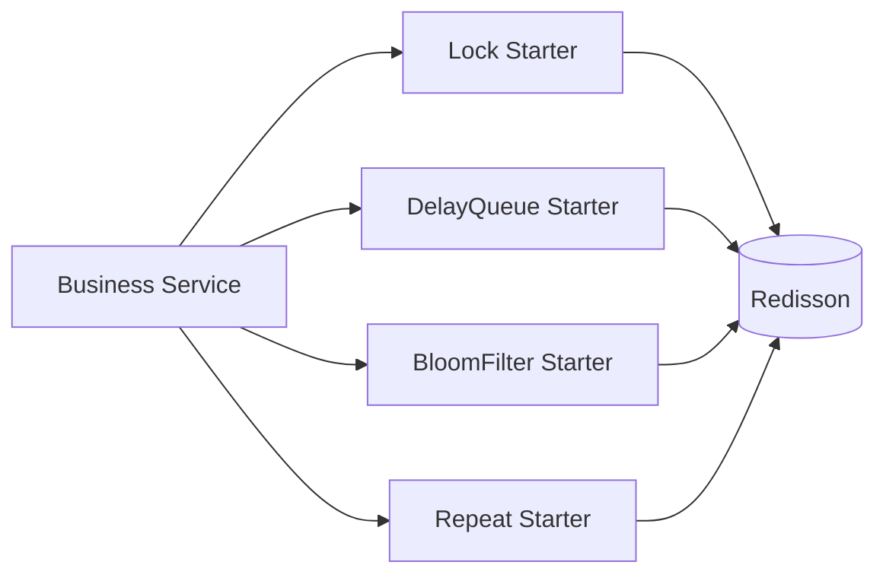

# peach-redission

English | [中文](README.md)

`peach-redission` (historical artifact/directory spelling retained for compatibility) provides four independent Redisson-based starters: distributed lock, delay queue, bloom filter and repeat guard. Shared Redisson foundations live in `peach-redission-common`.

## Structure

| Capability | Autoconfigure | Starter | Quickstart |
| --- | --- | --- | --- |
| Distributed Lock | `peach-redission-distributedlock-autoconfigure` | `peach-redission-distributedlock-starter` | `peach-redission-distributedlock-quickstart` |
| Delay Queue | `peach-redission-delayqueue-autoconfigure` | `peach-redission-delayqueue-starter` | `peach-redission-delayqueue-quickstart` |
| Bloom Filter | `peach-redission-bloomfilter-autoconfigure` | `peach-redission-bloomfilter-starter` | `peach-redission-bloomfilter-quickstart` |
| Repeat Guard | `peach-redission-repeat-autoconfigure` | `peach-redission-repeat-starter` | `peach-redission-repeat-quickstart` |

## Boundaries

- Distributed locks protect the smallest critical section and do not replace database uniqueness, transactions or state validation.
- Delay-queue consumers handle duplicates, retry and business idempotency.
- A bloom-filter "might exist" result requires authoritative lookup and cannot decide authorization, balance or uniqueness by itself.
- Repeat-guard keys come from stable business semantics and do not replace real idempotency design.
- Historical `redission` spelling is compatibility-only and is not a naming template for new modules.
