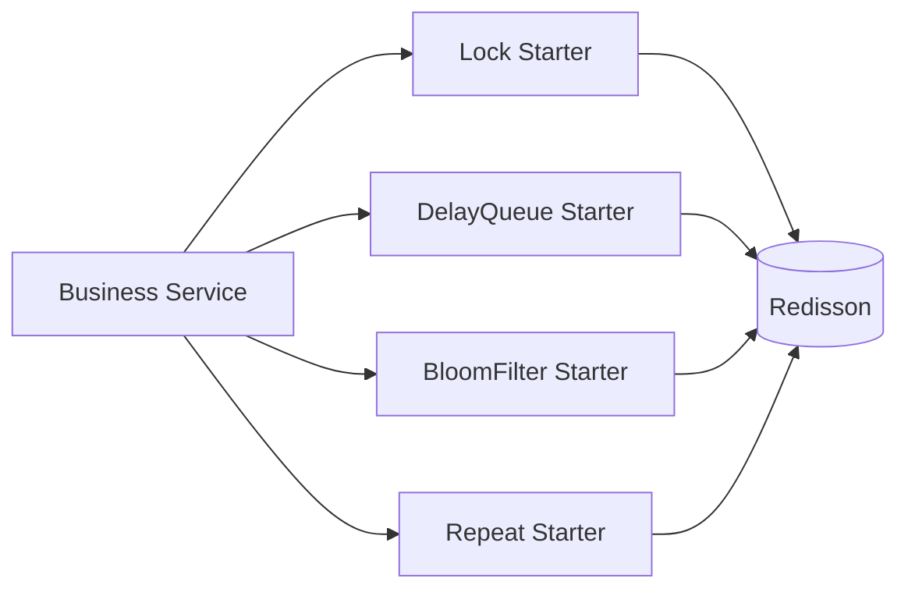

# peach-redission

English | [中文](README.md)

`peach-redission` (historical artifact/directory spelling retained for compatibility) provides four independent Redisson-based starters: distributed lock, delay queue, bloom filter and repeat guard. Shared Redisson foundations live in `peach-redission-common`.

## Structure

| Capability | Autoconfigure | Starter | Quickstart |
| --- | --- | --- | --- |
| Distributed Lock | `peach-redission-distributedlock-autoconfigure` | `peach-redission-distributedlock-starter` | `peach-redission-distributedlock-quickstart` |
| Delay Queue | `peach-redission-delayqueue-autoconfigure` | `peach-redission-delayqueue-starter` | `peach-redission-delayqueue-quickstart` |
| Bloom Filter | `peach-redission-bloomfilter-autoconfigure` | `peach-redission-bloomfilter-starter` | `peach-redission-bloomfilter-quickstart` |
| Repeat Guard | `peach-redission-repeat-autoconfigure` | `peach-redission-repeat-starter` | `peach-redission-repeat-quickstart` |

## Quick Start

Each capability ships a non-web quickstart (`spring.main.web-application-type=none`). Because many autoconfigure dependencies such as `peach-redis-common` are optional, quickstarts declare them explicitly. Provide a development Redis for local demos, or run the Testcontainers IT suite (`redis:7.2-alpine`).

### Distributed Lock

- Module: [`peach-redission-distributedlock-quickstart`](./peach-redission-distributedlock-quickstart/)
- Dependencies: `peach-redission-distributedlock-starter` + `peach-redis-common` (also `peach-redission-common`, `spring-boot-starter-aop`, `caffeine`)
- Capability samples (inventory deduct):
  - **Annotation**: `@DistrbutedLock` protects stock deduct
  - **Template**: inject `DistributedLockTemplate` for programmatic deduct
  - **Concurrency proof**: two threads compete with short `waitTime` (1 success / 1 failure)
- `DistributedLockDemoRunner` runs on startup; disable with `quickstart.distributedlock.demo.enabled=false`
- Run: `mvn -f peach-middleware/peach-redission/peach-redission-distributedlock-quickstart/pom.xml spring-boot:run`
- Test: `mvn -f peach-middleware/peach-redission/peach-redission-distributedlock-quickstart/pom.xml test`

### Delay Queue

- Module: [`peach-redission-delayqueue-quickstart`](./peach-redission-delayqueue-quickstart/)
- Capability samples (order timeout):
  - **Single message**: `DelayQueueContext#sendMessage` with short delay + implement `ConsumerTask` to confirm consume
  - **Multi message**: under reliable-queue config, send several messages and confirm all are consumed
- `DelayQueueDemoRunner` runs on startup; disable with `quickstart.delayqueue.demo.enabled=false`
- Minimal config: `peach.delay.queue.*` (example uses `isolation-region-count=1`, `use-reliable-queue=true`) plus `peach.redis.*`; consumer bootstrap needs `peach-initialize-starter`
- Run: `mvn -f peach-middleware/peach-redission/peach-redission-delayqueue-quickstart/pom.xml spring-boot:run`
- Test: `mvn -f peach-middleware/peach-redission/peach-redission-delayqueue-quickstart/pom.xml test`

### Bloom Filter

- Module: [`peach-redission-bloomfilter-quickstart`](./peach-redission-bloomfilter-quickstart/)
- Capability samples (inject `BloomFilterService`, product SKU pre-filter):
  - **Membership**: `initNamespace` + `add` + `mightContain` (present / absent)
  - **Batch**: `addAll` / `mightContainAll`
  - **Status and clear**: `status` / `segments` / `clear`
- `BloomFilterDemoRunner` runs on startup; disable with `quickstart.bloomfilter.demo.enabled=false`
- Minimal config: `peach.redis.bloom.enabled=true` (enabled by default) plus capacity/FPP settings, and `peach.redis.*`
- Run: `mvn -f peach-middleware/peach-redission/peach-redission-bloomfilter-quickstart/pom.xml spring-boot:run`
- Test: `mvn -f peach-middleware/peach-redission/peach-redission-bloomfilter-quickstart/pom.xml test`

### Repeat Guard

- Module: [`peach-redission-repeat-quickstart`](./peach-redission-repeat-quickstart/)
- Dependencies: `peach-redission-repeat-starter` + `peach-redission-distributedlock-starter` + `peach-redis-common` (also `peach-redission-common`, `spring-boot-starter-aop`, `caffeine`)
- Capability samples (order submit, public API is `@RepeatLimit`):
  - **Same-key reject**: second submit with the same requestId throws `IllegalStateException`
  - **Different-key isolation**: different requestIds do not interfere
- `RepeatDemoRunner` runs on startup; disable with `quickstart.repeat.demo.enabled=false`
- Run: `mvn -f peach-middleware/peach-redission/peach-redission-repeat-quickstart/pom.xml spring-boot:run`
- Test: `mvn -f peach-middleware/peach-redission/peach-redission-repeat-quickstart/pom.xml test`

`peach.redis.host` uses `host:port`. Quickstarts share defaults: `password=${PEACH_REDIS_PASSWORD:123456}`, `database=1` (override via env vars).

## Boundaries

- Distributed locks protect the smallest critical section and do not replace database uniqueness, transactions or state validation.
- Delay-queue consumers handle duplicates, retry and business idempotency.
- A bloom-filter "might exist" result requires authoritative lookup and cannot decide authorization, balance or uniqueness by itself.
- Repeat-guard keys come from stable business semantics and do not replace real idempotency design.
- Historical `redission` spelling is compatibility-only and is not a naming template for new modules.
