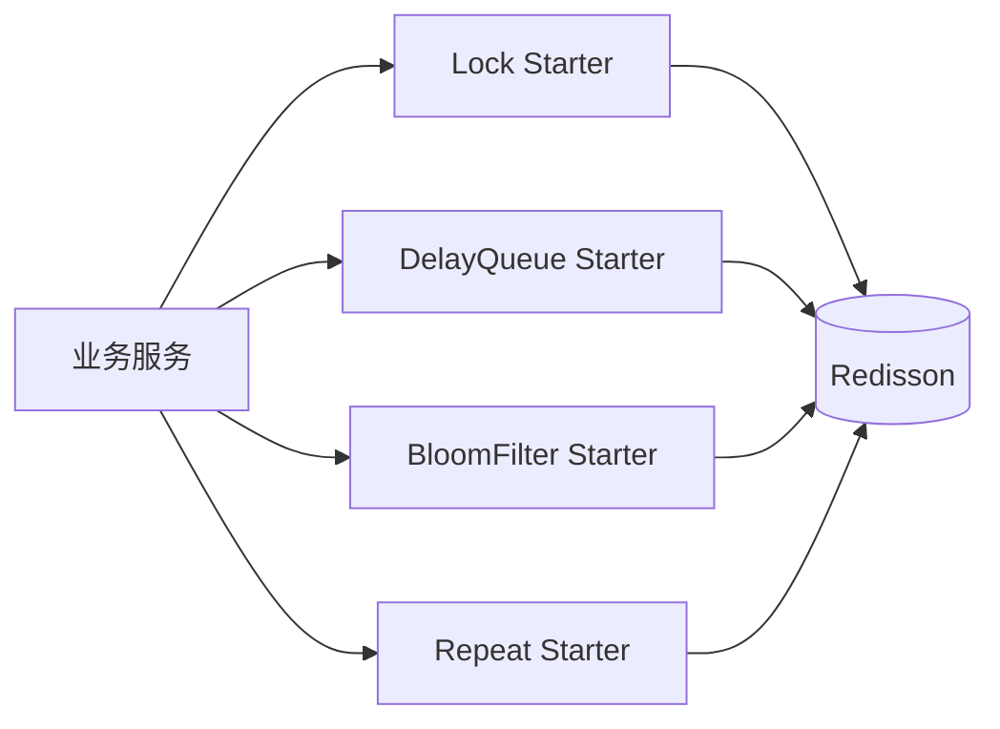

# peach-redission

[English](README.en-US.md) | 中文

`peach-redission`（保留历史 artifact/目录拼写）基于 Redisson 提供四个独立能力 Starter：分布式锁、延迟队列、布隆过滤器和防重复。共享 Redisson 基础契约位于 `peach-redission-common`。

## 结构

| 能力 | Autoconfigure | Starter | Quickstart |
| --- | --- | --- | --- |
| Distributed Lock | `peach-redission-distributedlock-autoconfigure` | `peach-redission-distributedlock-starter` | `peach-redission-distributedlock-quickstart` |
| Delay Queue | `peach-redission-delayqueue-autoconfigure` | `peach-redission-delayqueue-starter` | `peach-redission-delayqueue-quickstart` |
| Bloom Filter | `peach-redission-bloomfilter-autoconfigure` | `peach-redission-bloomfilter-starter` | `peach-redission-bloomfilter-quickstart` |
| Repeat Guard | `peach-redission-repeat-autoconfigure` | `peach-redission-repeat-starter` | `peach-redission-repeat-quickstart` |

## 边界

- 分布式锁只保护最小临界区，不替代数据库唯一约束、事务和状态校验。
- 延迟队列消费者必须处理重复、失败重试和业务幂等。
- 布隆过滤器“可能存在”需要回查权威数据源，不能直接用于授权、余额或唯一性最终判断。
- 防重复 key 必须来自稳定业务语义，不能替代真正的幂等设计。
- 历史 `redission` 拼写只做兼容，不作为新增模块命名模板扩散。
