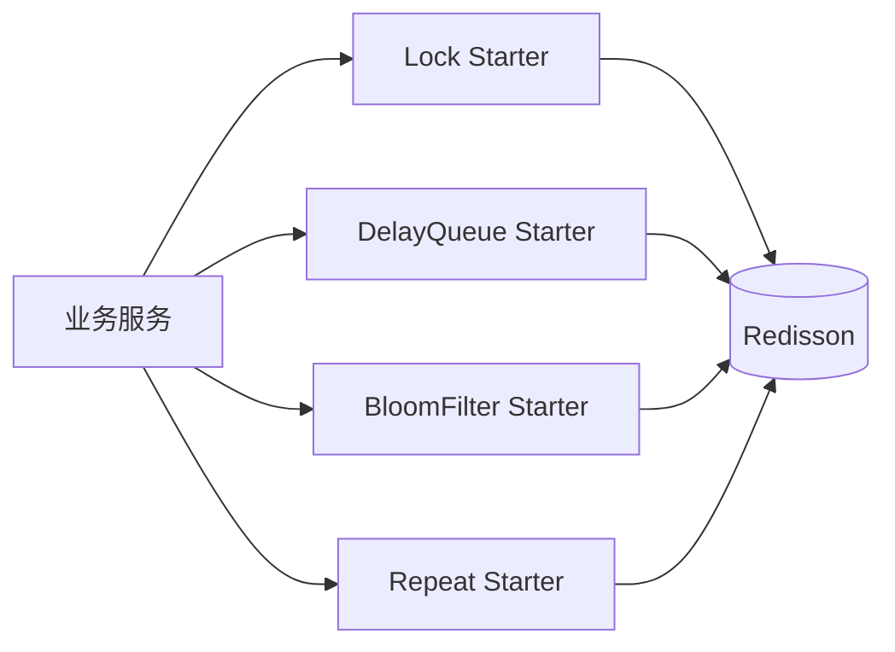

# peach-redission

[English](README.en-US.md) | 中文

`peach-redission`（保留历史 artifact/目录拼写）基于 Redisson 提供四个独立能力 Starter：分布式锁、延迟队列、布隆过滤器和防重复。共享 Redisson 基础契约位于 `peach-redission-common`。

## 结构

| 能力 | Autoconfigure | Starter | Quickstart |
| --- | --- | --- | --- |
| Distributed Lock | `peach-redission-distributedlock-autoconfigure` | `peach-redission-distributedlock-starter` | `peach-redission-distributedlock-quickstart` |
| Delay Queue | `peach-redission-delayqueue-autoconfigure` | `peach-redission-delayqueue-starter` | `peach-redission-delayqueue-quickstart` |
| Bloom Filter | `peach-redission-bloomfilter-autoconfigure` | `peach-redission-bloomfilter-starter` | `peach-redission-bloomfilter-quickstart` |
| Repeat Guard | `peach-redission-repeat-autoconfigure` | `peach-redission-repeat-starter` | `peach-redission-repeat-quickstart` |

## Quick Start

各能力均提供无 Web 端口的 quickstart（`spring.main.web-application-type=none`）。autoconfigure 中 `peach-redis-common` 等依赖多为 optional，quickstart 需显式引入。本地演示前提供开发 Redis，或直接跑 Testcontainers IT（`redis:7.2-alpine`）。

### Distributed Lock

- 模块：[`peach-redission-distributedlock-quickstart`](./peach-redission-distributedlock-quickstart/)
- 依赖：`peach-redission-distributedlock-starter` + `peach-redis-common`（另需 `peach-redission-common`、`spring-boot-starter-aop`、`caffeine`）
- 能力样例（库存扣减）：
  - **注解**：`@DistrbutedLock` 保护扣库存
  - **Template**：注入 `DistributedLockTemplate` 编程式扣库存
  - **并发证明**：双线程短 `waitTime` 竞争同一把锁（1 成功 / 1 失败）
- 启动后 `DistributedLockDemoRunner` 执行；关闭演示：`quickstart.distributedlock.demo.enabled=false`
- 运行：`mvn -pl peach-middleware/peach-redission/peach-redission-distributedlock-quickstart -am spring-boot:run`
- 测试：`mvn -pl peach-middleware/peach-redission/peach-redission-distributedlock-quickstart -am test`

### Delay Queue

- 模块：[`peach-redission-delayqueue-quickstart`](./peach-redission-delayqueue-quickstart/)
- 能力样例（订单超时）：
  - **单消息**：`DelayQueueContext#sendMessage` 短延迟投递 + 实现 `ConsumerTask` 消费确认
  - **多消息**：可靠队列配置下连续投递多条并全部消费确认
- 启动后 `DelayQueueDemoRunner` 执行；关闭演示：`quickstart.delayqueue.demo.enabled=false`
- 最小配置：`peach.delay.queue.*`（示例 `isolation-region-count=1`、`use-reliable-queue=true`），以及 `peach.redis.*`；消费初始化依赖 `peach-initialize-starter`
- 运行：`mvn -pl peach-middleware/peach-redission/peach-redission-delayqueue-quickstart -am spring-boot:run`
- 测试：`mvn -pl peach-middleware/peach-redission/peach-redission-delayqueue-quickstart -am test`

### Bloom Filter

- 模块：[`peach-redission-bloomfilter-quickstart`](./peach-redission-bloomfilter-quickstart/)
- 能力样例（注入 `BloomFilterService`，商品 SKU 预过滤）：
  - **成员判断**：`initNamespace` + `add` + `mightContain`（存在 / 不存在）
  - **批量**：`addAll` / `mightContainAll`
  - **状态与清理**：`status` / `segments` / `clear`
- 启动后 `BloomFilterDemoRunner` 依次执行；关闭演示：`quickstart.bloomfilter.demo.enabled=false`
- 最小配置：`peach.redis.bloom.enabled=true`（缺省启用）及容量/FPP 等，以及 `peach.redis.*`
- 运行：`mvn -pl peach-middleware/peach-redission/peach-redission-bloomfilter-quickstart -am spring-boot:run`
- 测试：`mvn -pl peach-middleware/peach-redission/peach-redission-bloomfilter-quickstart -am test`

### Repeat Guard

- 模块：[`peach-redission-repeat-quickstart`](./peach-redission-repeat-quickstart/)
- 依赖：`peach-redission-repeat-starter` + `peach-redission-distributedlock-starter` + `peach-redis-common`（另需 `peach-redission-common`、`spring-boot-starter-aop`、`caffeine`）
- 能力样例（下单防重复，公开能力为 `@RepeatLimit`）：
  - **同 key 拒绝**：同一 requestId 第二次提交抛出 `IllegalStateException`
  - **不同 key 隔离**：不同 requestId 互不影响
- 启动后 `RepeatDemoRunner` 执行；关闭演示：`quickstart.repeat.demo.enabled=false`
- 运行：`mvn -pl peach-middleware/peach-redission/peach-redission-repeat-quickstart -am spring-boot:run`
- 测试：`mvn -pl peach-middleware/peach-redission/peach-redission-repeat-quickstart -am test`

`peach.redis.host` 格式为 `host:port`。Quickstart 统一默认：`password` 默认为空（通过 `PEACH_REDIS_PASSWORD` 覆盖）、`database=1`。

## 边界

- 分布式锁只保护最小临界区，不替代数据库唯一约束、事务和状态校验。
- 延迟队列消费者必须处理重复、失败重试和业务幂等。
- 布隆过滤器“可能存在”需要回查权威数据源，不能直接用于授权、余额或唯一性最终判断。
- 防重复 key 必须来自稳定业务语义，不能替代真正的幂等设计。
- 历史 `redission` 拼写只做兼容，不作为新增模块命名模板扩散。
