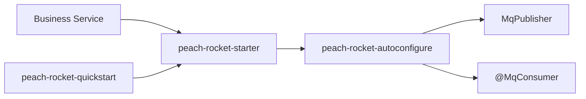

# Peach RocketMQ Starter

English | [中文](README.md)

`peach-rocket` is a RocketMQ business integration starter. It provides unified publishing, annotation-based routing, dynamic consumer registration, consumer idempotency, error handling, transaction messages, topic management, payload encryption, and Outbox reliable messaging.

`peach-rocket-starter` aggregates RocketMQ Spring Boot and Topic Admin runtime dependencies. Business modules should not redeclare `rocketmq-spring-boot-starter` or `rocketmq-tools`. Depending on autoconfigure alone is not the supported business entry point; missing RocketMQ client or admin classes will disable the related auto-configuration.

## Structure

| Submodule | Responsibility |
| --- | --- |
| `peach-rocket-autoconfigure` | Core APIs, auto-configuration, default implementations, and SPI |
| `peach-rocket-starter` | Starter exposed to business modules |
| `peach-rocket-quickstart` | Order publish-consume, orderly publish, and in-memory idempotency samples |



## Core Objects

| Object | Description |
| --- | --- |
| `MqPublisher` | Unified publish entrypoint |
| `@MqEvent` | Topic, tag, key, and version route declaration |
| `@MqConsumer` | Dynamic consumer declaration |
| `MqMessageHandler<T>` | Message handler interface |
| `MqConsumeContext` | Consume context |
| `MqSendOptions` | Per-send override options |
| `MqTransactionHandler<T>` / `@MqTransaction` | Transaction message handling |
| `MqIdempotentStore` | Consumer idempotency SPI |
| `MqOutboxStore` | Outbox storage SPI |
| `MqPayloadEncryptor`, `MqEncryptionPolicy`, `MqKeyProvider` | Payload encryption SPI |
| `MqTraceContextPropagator` | Optional MQ trace-context propagation SPI |

## Integration

```xml
<dependency>
    <groupId>com.peach</groupId>
    <artifactId>peach-rocket-starter</artifactId>
</dependency>
```

Baseline configuration:

```yaml
rocketmq:
  name-server: 127.0.0.1:9876
  producer:
    group: order-service-producer

peach:
  rocket:
    enabled: true
    namespace: dev
    app-name: order-service
    naming:
      topic-prefix: biz
      topic-separator: "-"
      auto-prefix-env: true
    consumer:
      dynamic-register: true
      enable-idempotent: true
    topic:
      auto-create: false
    outbox:
      enabled: false
```

## Publishing and Consuming

```java
@MqEvent(topic = "order", tag = "created", key = "#orderId")
public class OrderCreatedEvent {
    private String orderId;
}

@Service
@RequiredArgsConstructor
public class OrderEventPublisher {

    private final MqPublisher mqPublisher;

    public void publish(OrderCreatedEvent event) {
        mqPublisher.publish(event);
    }
}
```

```java
@Component
@MqConsumer(topic = "order", tag = "created", consumerGroup = "order-created-consumer")
public class OrderCreatedConsumer implements MqMessageHandler<OrderCreatedEvent> {
    @Override
    public void handle(OrderCreatedEvent message, MqConsumeContext context) {
        // handle message
    }
}
```

## SPI Overrides

- Routing: `MqRouteResolver`, annotation-based by default.
- Codec: `MqMessageCodec`.
- Idempotency: `MqIdempotentStore`, `MqIdempotentKeyResolver`.
- Error handling: `MqErrorHandler`, `MqExceptionClassifier`.
- Encryption: `MqKeyProvider`, `MqPayloadEncryptor`, `MqEncryptionPolicy`.
- Outbox: `MqOutboxStore`, `MqOutboxPublisher`, `MqOutboxReplayService`.
- Trace context: `MqTraceContextPropagator`; a no-op is used when Tracing is not present.

Prefer explicit `@Bean` overrides for in-memory idempotency and in-memory Outbox in production.

## Quick Start

[`peach-rocket-quickstart`](./peach-rocket-quickstart/) runs an in-process `MqPublisher` order loop (`web-application-type: none`) and does not connect to an external NameServer or Broker.

- Capability samples:
  - **Publish-consume**: `MqPublisher.publish` an order-created event and deliver it synchronously to the matching `@MqConsumer` by topic+tag
  - **Orderly publish**: `publishOrderly` uses a stable `orderId` as `shardingKey`, then delivers to the paid consumer
  - **Consume idempotency**: starter default `InMemoryMqIdempotentStore`; a second `tryStart` after `tryStart + markSuccess` is rejected
- `RocketDemoRunner` runs these on startup; disable with `quickstart.rocket.demo.enabled=false`
- Transaction messages, Outbox, and broker-level queue ordering require a real RocketMQ and are not covered here
- Run: `mvn -pl peach-middleware/peach-rocket/peach-rocket-quickstart -am spring-boot:run`
- Test: `mvn -pl peach-middleware/peach-rocket/peach-rocket-quickstart -am test`

The quickstart sets `peach.rocket.enabled` to `false` and excludes `RocketMQAutoConfiguration` so startup does not contact a broker. Business integration should still enable the starter with the configuration above.

## Production Boundaries

- Default in-memory idempotency and in-memory Outbox are for development or single-instance testing only.
- Production environments should override `MqIdempotentStore`, `MqOutboxStore`, and related SPI with explicit `@Bean`s.
- Topic auto-create is disabled by default; production topics should usually be managed by the platform.
- Orderly messages require a stable `shardingKey`.
- Outbox improves reliable delivery but does not replace business final-consistency state machines.
- Retries may invoke external systems more than once; consumers must be idempotent.
- RocketMQ Broker, NameServer, and console deployment are outside this module.
- After introducing `peach-observability-starter`, the standard Trace Context is written to message headers and restored on consume; do not set `traceparent` in business code.

## Verification

```bash
mvn -f "peach-middleware/peach-rocket/pom.xml" test
mvn -f "peach-middleware/peach-rocket/pom.xml" clean package -DskipTests -Pdevelopment
```

## Troubleshooting

| Symptom | Check | Action |
| --- | --- | --- |
| `MqPublisher` is not injected | `peach-rocket-starter` is present; `peach.rocket.enabled` is on | Check the dependency and auto-configuration conditions |
| Consumer is not registered | `@MqConsumer` beans are scanned; `dynamic-register` is on | Check package scan and configuration |
| Duplicate consume | Idempotency key is stable; store is production-ready | Override `MqIdempotentStore` |
| Transaction message is not checked back | `@MqTransaction` matches `MqTransactionHandler` | Check transaction handler registration |
| Outbox backlog | Dispatcher is running; store status can be updated | Check `MqOutboxStore` and scheduler logs |
| Startup reports missing `RocketMQTemplate` | Autoconfigure-only dependency; final artifact includes RocketMQ Spring | Use `peach-rocket-starter` and rebuild |
| Topic auto-create misses `DefaultMQAdminExt` | Final artifact includes `rocketmq-tools` | Use the latest `peach-rocket-starter` and rebuild |

## Project conventions

- Backend documentation follows the current peach-cloud baseline: Java 21, Spring Boot 3.5.4, Spring Cloud 2025.0.0, and Spring Cloud Alibaba 2025.0.0.0.
- Frontend documentation applies only to peach-cloud-front, which is a separate Vue 3 + Vite + TypeScript project and is not part of the Maven reactor.
- Source, scripts, SQL, and Markdown files must stay UTF-8 without BOM. Do not document generated output such as target/, .flattened-pom.xml, dependency caches, or IDE files as source layout.
- Commands and examples must be verifiable against the current repository. Do not include real secrets, tokens, private keys, production passwords, signed URLs, or complete sensitive payloads.
