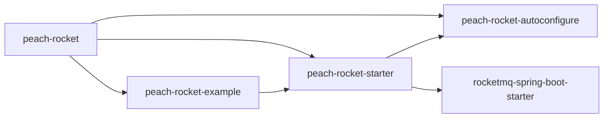
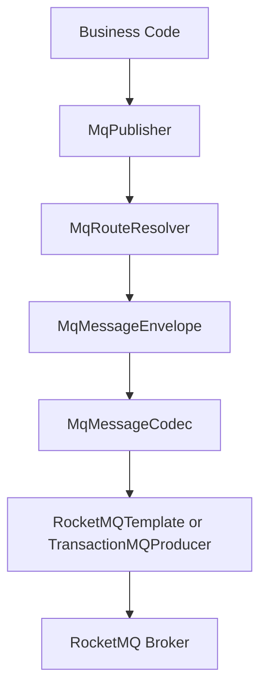
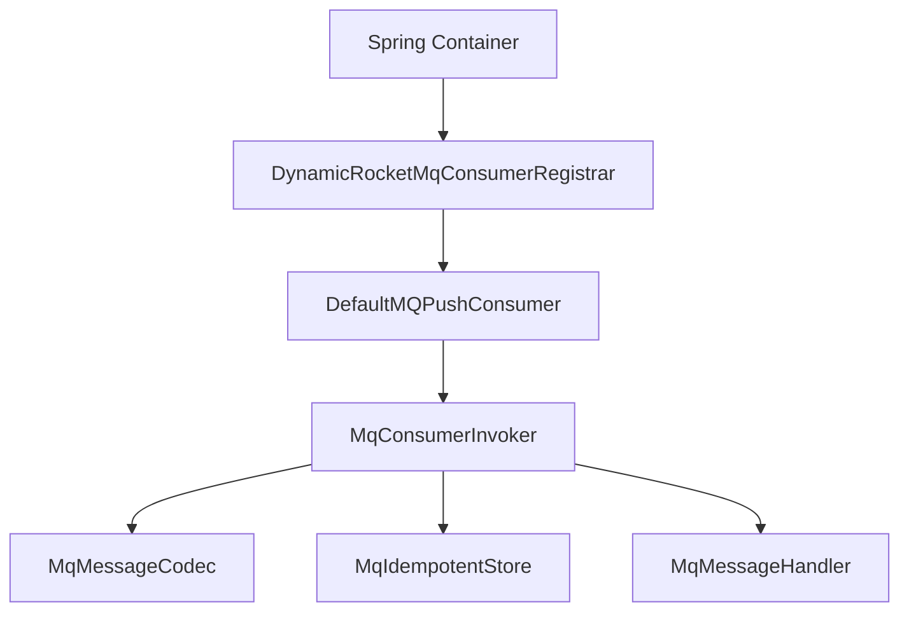
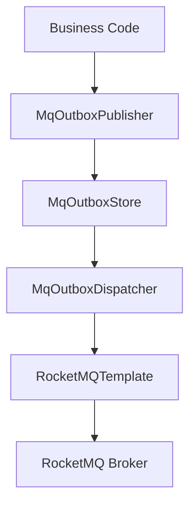

# Peach RocketMQ Starter

[中文](README.md)

Last Updated: 2026/6/26  
Maintainer: Mr Shu  
Applies To: `peach-cloud 1.0.0-SNAPSHOT`, JDK 8, Spring Boot 2.7.13

## 1. Overview

`peach-rocket` is the RocketMQ integration module in the Peach project. Its goal is to keep native RocketMQ concepts visible while encapsulating repetitive business-side concerns such as publishing, routing, serialization, dynamic consumer registration, consumer idempotency, transaction messages, topic governance, optional payload encryption, and Outbox-based reliable messaging into unified APIs, default implementations, and overridable SPI contracts.

The module now uses a three-part structure:

- `peach-rocket-autoconfigure`: core APIs, auto-configuration, and default implementations.
- `peach-rocket-starter`: the starter module that business applications actually depend on.
- `peach-rocket-example`: a minimal runnable example module that also contains the JDBC override examples for idempotency and Outbox.

One important adjustment in the current design is:

- the core starter no longer ships JDBC idempotency and JDBC Outbox as built-in defaults,
- JDBC-specific implementations have been moved into the `example` module,
- if a business project needs JDBC-based behavior, it should follow the `@Bean` override approach shown in the example module.

This module intentionally does not provide the following:

- It does not deploy RocketMQ NameServer or Broker.
- It does not provide a RocketMQ management console.
- It does not replace native `rocketmq.*` connection configuration.
- It does not enable topic auto-creation, payload encryption, or Outbox by default.
- It does not treat tags as managed broker resources, because tags are not standalone broker resources.

## 2. Scope and Boundaries

### 2.1 What the module provides

- Unified publishing API: `MqPublisher`
- Annotation-driven event routing: `@MqEvent`
- Annotation-driven dynamic consumers: `@MqConsumer + MqMessageHandler<T>`
- Standard message envelope: `MqMessageEnvelope<T>`
- Routing and naming rules: `MqRouteResolver`, `RocketMqNaming`
- JSON codec with optional payload encryption: `MqMessageCodec`
- Consumer idempotency: default in-memory implementation and idempotent-key SPI
- Error handling and exception classification: `MqExceptionClassifier`, `MqErrorHandler`
- Transaction messages: `@MqTransaction + MqTransactionHandler<T>`
- Topic auto-creation: `RocketMqTopicAdmin`
- Outbox reliable messaging: default in-memory implementation, publisher, replay service, and dispatcher

### 2.2 What the module does not provide

- It does not guarantee end-to-end business consistency. Outbox is a generic mechanism, not a substitute for business state machines.
- It does not include built-in Redis idempotency, KMS integration, or audit platform integration. These are left to SPI overrides.
- It does not include JDBC idempotency or JDBC Outbox as production defaults anymore. Those examples were moved into the example module.
- It does not include an operations console, alert center, or dashboard.

## 3. Module Structure

The following tree shows source and documentation related files only. Build outputs such as `target/` are intentionally excluded.

```text
peach-middleware/peach-rocket/
├── .gitignore
├── pom.xml
├── README.md
├── README.en-US.md
├── peach-rocket-autoconfigure/
│   ├── pom.xml
│   └── src/main/
│       ├── java/com/peach/rocket/
│       │   ├── annotation/
│       │   ├── autoconfigure/
│       │   ├── codec/
│       │   ├── consumer/
│       │   ├── context/
│       │   ├── core/
│       │   ├── error/
│       │   ├── exception/
│       │   ├── idempotent/
│       │   ├── outbox/
│       │   ├── producer/
│       │   ├── route/
│       │   ├── security/
│       │   ├── support/
│       │   ├── topic/
│       │   └── transaction/
│       └── resources/
│           └── META-INF/spring/org.springframework.boot.autoconfigure.AutoConfiguration.imports
├── peach-rocket-starter/
│   └── pom.xml
└── peach-rocket-example/
    ├── pom.xml
    └── src/main/
        ├── java/com/peach/rocket/example/
        │   ├── config/
        │   │   └── jdbc/
        │   ├── consumer/
        │   ├── event/
        │   ├── runner/
        │   ├── service/
        │   └── PeachRocketExampleApplication.java
        └── resources/
            ├── application.yml
            └── schema/
                ├── mq_consume_record_mysql.sql
                └── mq_outbox_event_mysql.sql
```

## 4. Module and File Responsibilities

### 4.1 Root-level files

| Path | Responsibility |
| --- | --- |
| `peach-middleware/peach-rocket/pom.xml` | Aggregator POM that declares the `autoconfigure`, `starter`, and `example` submodules. |
| `peach-middleware/peach-rocket/README.md` | Main Chinese documentation. |
| `peach-middleware/peach-rocket/README.en-US.md` | Main English documentation aligned with the Chinese version. |
| `peach-middleware/peach-rocket/.gitignore` | Module-level ignore rules. |

### 4.2 `peach-rocket-autoconfigure` packages and files

#### `annotation`

| File | Responsibility |
| --- | --- |
| `MqEvent.java` | Declares default `topic`, `tag`, `key`, and `version` for business events. |
| `MqConsumer.java` | Declares subscription metadata, consume mode, message model, and idempotency flag for dynamic consumers. |
| `MqEncrypted.java` | Marks an event class as participating in payload encryption rules. |
| `MqTransaction.java` | Declares the `topic` and `tag` handled by a transaction message handler. |

#### `autoconfigure`

| File | Responsibility |
| --- | --- |
| `PeachRocketAutoConfigure.java` | Main auto-configuration entry that assembles publisher, consumer, routing, codec, idempotency, error handling, transaction support, and topic admin beans. |
| `PeachRocketOutboxAutoConfigure.java` | Outbox auto-configuration entry that conditionally assembles the default in-memory Outbox implementation, publisher, replay service, and dispatcher beans. |
| `PeachRocketProperties.java` | The `peach.rocket.*` configuration model with all currently effective properties. |

#### `codec`

| File | Responsibility |
| --- | --- |
| `MqMessageCodec.java` | SPI for encoding and decoding standard message envelopes. |
| `JacksonMqMessageCodec.java` | Standard Jackson-based JSON codec for message envelopes. |
| `SecureJacksonMqMessageCodec.java` | JSON codec with optional payload encryption and decryption. |

#### `consumer`

| File | Responsibility |
| --- | --- |
| `DynamicRocketMqConsumerRegistrar.java` | Scans `MqMessageHandler` beans and registers native `DefaultMQPushConsumer` instances based on `@MqConsumer`. |
| `MqConsumerInvoker.java` | Unified consume pipeline that handles deserialization, context building, idempotency, business callback, error classification, and logging. |

#### `context`

| File | Responsibility |
| --- | --- |
| `DefaultMqHeaderResolver.java` | Normalizes user-provided message headers. |

#### `core`

| File | Responsibility |
| --- | --- |
| `MqPublisher.java` | Unified publishing API for sync, async, one-way, orderly, delay, and transaction publishing. |
| `MqSendOptions.java` | Per-send overrides such as `topic`, `tag`, `key`, `timeoutMillis`, `headers`, and `delay`. |
| `MqSendResult.java` | Unified publishing result model. |
| `MqDelay.java` | Delay message parameter model, supporting either duration or RocketMQ delay level. |
| `MqMessageEnvelope.java` | Standard message envelope carrying metadata, headers, payload, and encryption markers. |
| `MqMessageHandler.java` | Business consumer contract. |
| `MqConsumeContext.java` | Consume context exposing message id, topic, tag, key, retry count, and headers. |
| `MqConsumeMode.java` | Enum for concurrent vs orderly consumption. |
| `MqMessageModel.java` | Enum for clustering vs broadcasting consumption. |
| `MqLocalTransactionState.java` | Enum for local transaction status. |
| `MqTransactionHandler.java` | SPI for executing and checking local transactions. |

#### `error`

| File | Responsibility |
| --- | --- |
| `MqFailureAction.java` | Failure action enum, currently `RETRY` or `SKIP`. |
| `MqExceptionClassifier.java` | SPI for classifying consume exceptions. |
| `DefaultMqExceptionClassifier.java` | Default classifier that currently retries by default. |
| `MqErrorHandler.java` | SPI for consume error handling. |
| `DefaultMqErrorHandler.java` | Default error handler that writes structured error logs. |

#### `exception`

| File | Responsibility |
| --- | --- |
| `MqException.java` | Unified runtime exception type for this module. |

#### `idempotent`

| File | Responsibility |
| --- | --- |
| `MqIdempotentContext.java` | Idempotency context model. |
| `MqIdempotentStore.java` | Idempotent store SPI. |
| `MqIdempotentKeyResolver.java` | Idempotent key resolver SPI. |
| `DefaultMqIdempotentKeyResolver.java` | Default idempotent key resolver. |
| `InMemoryMqIdempotentStore.java` | In-memory idempotent store for development and single-instance testing. |

#### `outbox`

| File | Responsibility |
| --- | --- |
| `MqOutboxStatus.java` | Outbox message status enum. |
| `MqOutboxEvent.java` | Outbox event entity. |
| `MqOutboxStore.java` | Outbox storage SPI. |
| `MqOutboxPublisher.java` | Outbox publishing SPI. |
| `MqOutboxReplayService.java` | Replay service SPI for failed Outbox messages. |
| `InMemoryMqOutboxStore.java` | In-memory Outbox store. |
| `DefaultMqOutboxPublisher.java` | Default Outbox publisher that writes standard envelopes into the Outbox store. |
| `DefaultMqOutboxReplayService.java` | Default replay service for failed Outbox messages. |
| `MqOutboxDispatcher.java` | Dispatcher that scans pending Outbox events and republishes them to RocketMQ. |

#### `producer`

| File | Responsibility |
| --- | --- |
| `RocketMqPublisher.java` | Default `MqPublisher` implementation backed by `RocketMQTemplate`. |

#### `route`

| File | Responsibility |
| --- | --- |
| `MqRoute.java` | Send route model. |
| `MqRouteResolver.java` | Route resolution SPI. |
| `AnnotationMqRouteResolver.java` | Default route resolver based on `@MqEvent` and `MqSendOptions`. |

#### `security`

| File | Responsibility |
| --- | --- |
| `MqKeyProvider.java` | SPI for providing encryption keys. |
| `MqEncryptionPolicy.java` | SPI for deciding whether a payload should be encrypted. |
| `MqPayloadEncryptor.java` | SPI for payload encryption and decryption. |
| `MqEncryptionContext.java` | Encryption context model. |
| `MqEncryptionResult.java` | Encryption result model. |
| `ConfigMqKeyProvider.java` | Default key provider that reads keys from configuration. |
| `ConfigurableMqEncryptionPolicy.java` | Default encryption policy driven by config and `@MqEncrypted`. |
| `AesGcmMqPayloadEncryptor.java` | Default AES-GCM payload encryptor. |

#### `support`

| File | Responsibility |
| --- | --- |
| `RocketMqNaming.java` | Helper for topic and consumer group naming conventions. |

#### `topic`

| File | Responsibility |
| --- | --- |
| `RocketMqTopicAdmin.java` | Topic auto-creation component. It manages topics only, not tags. |

#### `transaction`

| File | Responsibility |
| --- | --- |
| `RocketMqTransactionMessageProducer.java` | Transaction message producer built on native `TransactionMQProducer`. |

### 4.3 `peach-rocket-autoconfigure` resource files

| File | Responsibility |
| --- | --- |
| `META-INF/spring/org.springframework.boot.autoconfigure.AutoConfiguration.imports` | Spring Boot 2.7 auto-configuration registration file. |

### 4.4 `peach-rocket-starter`

| File | Responsibility |
| --- | --- |
| `peach-rocket-starter/pom.xml` | Starter module exposed to business projects. It aggregates `peach-rocket-autoconfigure` and `rocketmq-spring-boot-starter`. |

Note: this module intentionally contains almost no source code. That is normal for a starter and keeps business integration simple.

### 4.5 `peach-rocket-example` packages and files

#### `config`

| File | Responsibility |
| --- | --- |
| `config/ExampleJdbcRocketConfiguration.java` | When a `JdbcTemplate` exists in the example application, this configuration overrides the default in-memory idempotency and Outbox beans through explicit `@Bean` declarations. |
| `config/jdbc/ExampleJdbcMqIdempotentStore.java` | Example-specific JDBC idempotent store showing how a business project can customize `MqIdempotentStore`. |
| `config/jdbc/ExampleJdbcMqOutboxStore.java` | Example-specific JDBC Outbox store showing how a business project can customize `MqOutboxStore`. |

#### `event`

| File | Responsibility |
| --- | --- |
| `event/OrderCreatedEvent.java` | Example order-created event demonstrating `@MqEvent`. |
| `event/OrderPaidEvent.java` | Example order-paid event demonstrating `@MqEvent`. |

#### `consumer`

| File | Responsibility |
| --- | --- |
| `consumer/OrderCreatedConsumer.java` | Consumer for the order-created event. |
| `consumer/OrderPaidConsumer.java` | Consumer for the order-paid event. |

#### `service / runner / root`

| File | Responsibility |
| --- | --- |
| `service/OrderService.java` | Example publishing service demonstrating sync, async, orderly, and delay messages. |
| `runner/PeachRocketDemoRunner.java` | Startup runner that conditionally publishes demo messages. |
| `PeachRocketExampleApplication.java` | Example application entry point. |
| `resources/application.yml` | Example module runtime configuration. |
| `resources/schema/mq_consume_record_mysql.sql` | Example DDL for the JDBC idempotency table. |
| `resources/schema/mq_outbox_event_mysql.sql` | Example DDL for the JDBC Outbox table. |

Note: the example module now demonstrates not only basic messaging but also the JDBC override pattern. Business projects that need JDBC-based behavior can directly follow this `@Bean` override approach.

## 5. Maven Layout and Dependency Graph

### 5.1 Module dependency graph



### 5.2 Baseline versions

| Item | Version |
| --- | --- |
| JDK | 1.8 |
| Spring Boot | 2.7.13 |
| RocketMQ Spring Boot Starter | 2.2.3 |
| RocketMQ Client / Common / Remoting / Tools | 5.3.2 |

## 6. Core Architecture

### 6.1 Publish flow



### 6.2 Dynamic consume flow



### 6.3 Outbox flow



## 7. Quick Start

### 7.1 Add the dependency

```xml
<dependency>
    <groupId>com.peach</groupId>
    <artifactId>peach-rocket-starter</artifactId>
</dependency>
```

### 7.2 Minimal configuration

```yaml
rocketmq:
  name-server: 127.0.0.1:9876
  producer:
    group: order-service-producer

peach:
  rocket:
    namespace: dev
    app-name: order-service
    naming:
      topic-prefix: biz
      topic-separator: '-'
    consumer:
      dynamic-register: true
```

### 7.3 Minimal publish sample

```java
@Resource
private MqPublisher mqPublisher;

mqPublisher.publish(event);
mqPublisher.publishAsync(event);
mqPublisher.publishOrderly(event, String.valueOf(event.getOrderId()));
mqPublisher.publishDelay(event, MqDelay.duration(Duration.ofSeconds(10)));
```

### 7.4 Minimal consume sample

```java
@Slf4j
@Component
@MqConsumer(topic = "order", tag = "paid", consumerGroup = "order-service-order-paid")
public class OrderPaidConsumer implements MqMessageHandler<OrderPaidEvent> {

    @Override
    public void handle(OrderPaidEvent message, MqConsumeContext context) {
        log.info("order paid. orderId={} messageId={}", message.getOrderId(), context.getMessageId());
    }
}
```

## 8. Final Complete Configuration List

The list below contains the full set of properties that are actually effective in the current version. Any `peach.rocket.*` property not listed here should no longer be used.

### 8.1 Native `rocketmq.*` configuration

These are not defined by Peach Rocket itself, but business projects typically need at least the following:

| Property | Description |
| --- | --- |
| `rocketmq.name-server` | RocketMQ NameServer address. |
| `rocketmq.producer.group` | Native RocketMQ producer group. |

### 8.2 `peach.rocket` root configuration

| Property | Default | Description |
| --- | --- | --- |
| `peach.rocket.enabled` | `true` | Whether Peach Rocket auto-configuration is enabled. |
| `peach.rocket.namespace` | `default` | Environment or business-domain namespace. |
| `peach.rocket.app-name` | `application` | Application name written into the envelope. |

### 8.3 `peach.rocket.producer`

| Property | Default | Description |
| --- | --- | --- |
| `peach.rocket.producer.default-timeout` | `3s` | Default send timeout. |

### 8.4 `peach.rocket.consumer`

| Property | Default | Description |
| --- | --- | --- |
| `peach.rocket.consumer.enable-idempotent` | `true` | Enables consumer idempotency protection. |
| `peach.rocket.consumer.idempotent-expire` | `24h` | Expiration time for idempotent records. |
| `peach.rocket.consumer.dynamic-register` | `true` | Enables dynamic consumer registration through `@MqConsumer`. |
| `peach.rocket.consumer.consume-thread-min` | `1` | Minimum native consumer thread count. |
| `peach.rocket.consumer.consume-thread-max` | `20` | Maximum native consumer thread count. |

### 8.5 `peach.rocket.naming`

| Property | Default | Description |
| --- | --- | --- |
| `peach.rocket.naming.topic-prefix` | `biz` | Business prefix for topics. |
| `peach.rocket.naming.group-prefix` | `cg` | Reserved prefix field for consumer groups. |
| `peach.rocket.naming.topic-separator` | `-` | Separator used in normalized topic names. |
| `peach.rocket.naming.auto-prefix-env` | `true` | Whether to automatically build the real topic name. |

### 8.6 `peach.rocket.security`

| Property | Default | Description |
| --- | --- | --- |
| `peach.rocket.security.enabled` | `false` | Enables security enhancement. |
| `peach.rocket.security.encrypt-payload` | `false` | Encrypts all payloads by default. |
| `peach.rocket.security.algorithm` | `AES_GCM` | Default encryption algorithm. |
| `peach.rocket.security.key-id` | `default` | Default key identifier. |
| `peach.rocket.security.key` | empty | Default key content. |
| `peach.rocket.security.base64-key` | `false` | Whether the configured key should be Base64-decoded. |
| `peach.rocket.security.encrypt-topics` | empty list | Whitelist of real topics requiring encryption. |

### 8.7 `peach.rocket.transaction`

| Property | Default | Description |
| --- | --- | --- |
| `peach.rocket.transaction.enabled` | `true` | Enables transaction messaging support. |
| `peach.rocket.transaction.producer-group` | `peach-rocket-transaction-producer` | Producer group used by transaction messages. |

### 8.8 `peach.rocket.topic`

| Property | Default | Description |
| --- | --- | --- |
| `peach.rocket.topic.auto-create` | `false` | Enables topic auto-creation. |
| `peach.rocket.topic.read-queue-nums` | `4` | Default read queue count. |
| `peach.rocket.topic.write-queue-nums` | `4` | Default write queue count. |
| `peach.rocket.topic.include-consumer-topics` | `true` | Collects topics from `@MqConsumer`. |
| `peach.rocket.topic.include-transaction-topics` | `true` | Collects topics from `@MqTransaction`. |
| `peach.rocket.topic.topics` | empty list | Explicit additional topics to create. |

### 8.9 `peach.rocket.outbox`

| Property | Default | Description |
| --- | --- | --- |
| `peach.rocket.outbox.enabled` | `false` | Enables Outbox support. |
| `peach.rocket.outbox.batch-size` | `50` | Batch size for scanning and sending. |
| `peach.rocket.outbox.scan-interval-ms` | `2000` | Scan interval for the Outbox dispatcher. |

### 8.10 `example.rocket`

The example module currently exposes only one demo switch:

| Property | Default | Description |
| --- | --- | --- |
| `example.rocket.demo.enabled` | `true` | Whether demo messages are published automatically after startup. |

## 9. Key Capability Details

### 9.1 Annotation routing and naming

- `@MqEvent` provides default `topic`, `tag`, and `key`.
- `MqSendOptions` can override routing for a single send call.
- `AnnotationMqRouteResolver` reads `MqSendOptions` first and falls back to `@MqEvent`.
- When `auto-prefix-env=true`, a business topic like `order` becomes a real topic such as `dev-biz-order`.
- Keys support expressions such as `#orderId`.

### 9.2 Standard message envelope

All publishing operations are built around `MqMessageEnvelope<T>`, which includes:

- `messageId`
- `topic`
- `tag`
- `key`
- `producerApp`
- `payloadType`
- `version`
- `headers`
- `payload`
- `createdAt`
- encryption markers and metadata

### 9.3 Dynamic consumer registration

A bean becomes a managed dynamic RocketMQ consumer when it:

- implements `MqMessageHandler<T>`, and
- is annotated with `@MqConsumer`.

`DynamicRocketMqConsumerRegistrar` then creates and starts a native `DefaultMQPushConsumer` for it after application startup. Business code does not need to write RocketMQ Spring native listener annotations.

### 9.4 Consumer idempotency

The starter now provides only one default implementation:

- `InMemoryMqIdempotentStore`

If a business project needs JDBC idempotency, it should follow the example module and provide its own bean override, using:

- `ExampleJdbcRocketConfiguration`
- `ExampleJdbcMqIdempotentStore`

### 9.5 Payload encryption

Current default implementation stack:

- key provider: `ConfigMqKeyProvider`
- policy: `ConfigurableMqEncryptionPolicy`
- algorithm implementation: `AesGcmMqPayloadEncryptor`

Encryption is triggered when:

- `peach.rocket.security.encrypt-payload=true`, or
- the event class is annotated with `@MqEncrypted`, or
- the real topic is listed in `encrypt-topics`

### 9.6 Transaction messages

Transaction messaging is implemented by `RocketMqTransactionMessageProducer`. Business code uses:

- `@MqTransaction`
- `MqTransactionHandler<T>`
- `MqPublisher.publishTransaction(...)`

for local transaction execution and broker-side transaction checks.

### 9.7 Topic auto-creation

`RocketMqTopicAdmin` collects topics from:

- `peach.rocket.topic.topics`
- `@MqConsumer`
- `@MqTransaction`

and then uses RocketMQ admin APIs to create or update topics. This feature is intended for development, testing, or tightly governed platform environments. It is recommended to keep it disabled in production.

### 9.8 Outbox reliable messaging

The starter currently provides these default Outbox pieces:

- `MqOutboxPublisher`
- `InMemoryMqOutboxStore`
- `MqOutboxDispatcher`
- `MqOutboxReplayService`

If a business project needs JDBC Outbox, it should follow the example module and override `MqOutboxStore` with its own bean, using:

- `ExampleJdbcRocketConfiguration`
- `ExampleJdbcMqOutboxStore`

## 10. Auto-Configuration Details

Auto-configuration registration file:

```text
peach-rocket-autoconfigure/src/main/resources/META-INF/spring/org.springframework.boot.autoconfigure.AutoConfiguration.imports
```

Registered classes:

```text
com.peach.rocket.autoconfigure.PeachRocketAutoConfigure
com.peach.rocket.autoconfigure.PeachRocketOutboxAutoConfigure
```

### 10.1 Default beans from `PeachRocketAutoConfigure`

| Bean | Default implementation | Activation condition |
| --- | --- | --- |
| `MqKeyProvider` | `ConfigMqKeyProvider` | `peach.rocket.security.enabled=true` |
| `MqPayloadEncryptor` | `AesGcmMqPayloadEncryptor` | `peach.rocket.security.enabled=true` |
| `MqEncryptionPolicy` | `ConfigurableMqEncryptionPolicy` | `peach.rocket.security.enabled=true` |
| `MqMessageCodec` | `JacksonMqMessageCodec` / `SecureJacksonMqMessageCodec` | Chosen automatically depending on whether security is enabled |
| `MqRouteResolver` | `AnnotationMqRouteResolver` | default |
| `DefaultMqHeaderResolver` | `DefaultMqHeaderResolver` | default |
| `MqIdempotentStore` | `InMemoryMqIdempotentStore` | default |
| `MqIdempotentKeyResolver` | `DefaultMqIdempotentKeyResolver` | default |
| `MqErrorHandler` | `DefaultMqErrorHandler` | default |
| `MqExceptionClassifier` | `DefaultMqExceptionClassifier` | default |
| `MqConsumerInvoker` | `MqConsumerInvoker` | default |
| `DynamicRocketMqConsumerRegistrar` | `DynamicRocketMqConsumerRegistrar` | `dynamic-register=true` |
| `RocketMqTopicAdmin` | `RocketMqTopicAdmin` | `topic.auto-create=true` |
| `RocketMqTransactionMessageProducer` | `RocketMqTransactionMessageProducer` | `transaction.enabled=true` and transaction handlers exist |
| `MqPublisher` | `RocketMqPublisher` | default |

### 10.2 Default beans from `PeachRocketOutboxAutoConfigure`

| Bean | Default implementation | Activation condition |
| --- | --- | --- |
| `MqOutboxStore` | `InMemoryMqOutboxStore` | `outbox.enabled=true` |
| `MqOutboxPublisher` | `DefaultMqOutboxPublisher` | `MqOutboxStore` exists |
| `MqOutboxDispatcher` | `MqOutboxDispatcher` | `MqOutboxStore` and `RocketMQTemplate` exist |
| `MqOutboxReplayService` | `DefaultMqOutboxReplayService` | `MqOutboxStore` exists |

## 11. Extension Points

The following points can be overridden by declaring beans of the same type in business applications:

| SPI / Type | Responsibility |
| --- | --- |
| `MqRouteResolver` | Custom topic/tag/key resolution |
| `MqMessageCodec` | Custom message format or codec |
| `MqPayloadEncryptor` | Custom encryption algorithm |
| `MqEncryptionPolicy` | Custom encryption trigger rules |
| `MqKeyProvider` | Integrate with KMS, config center, or external key services |
| `MqIdempotentStore` | Integrate with Redis, JDBC, database state-machines, or business-unique-key logic |
| `MqIdempotentKeyResolver` | Customize how idempotent keys are built |
| `MqErrorHandler` | Integrate with audit, alerting, or observability systems |
| `MqExceptionClassifier` | Control retry vs skip behavior |
| `MqOutboxStore` | Customize Outbox persistence and dispatch behavior |

## 12. Example Module

Example module path:

```text
peach-middleware/peach-rocket/peach-rocket-example
```

The current example actually covers:

- `OrderCreatedEvent` / `OrderPaidEvent`
- synchronous publishing
- asynchronous publishing
- orderly publishing
- delayed publishing
- dynamic consumer registration
- JDBC idempotency override example
- JDBC Outbox override example
- startup runner and minimal configuration

JDBC override pattern example:

```java
@Bean
public MqIdempotentStore exampleJdbcMqIdempotentStore(JdbcTemplate jdbcTemplate) {
    return new ExampleJdbcMqIdempotentStore(jdbcTemplate);
}

@Bean
public MqOutboxStore exampleJdbcMqOutboxStore(JdbcTemplate jdbcTemplate) {
    return new ExampleJdbcMqOutboxStore(jdbcTemplate);
}
```

This is also the recommended integration model for business projects:

- keep generic defaults in the starter,
- override them with explicit `@Bean` definitions when JDBC, Redis, or another implementation is needed.

## 13. Build and Validation

Module-level build command:

```bash
mvn -f "peach-middleware/peach-rocket/pom.xml" -DskipTests package
```

This refactor has already been validated with:

- successful standalone build of the `peach-rocket` reactor,
- Peach backend style checker result of `Errors: 0` and `Warnings: 0` for `peach-middleware/peach-rocket`.

Note: a repository-wide `mvn -pl peach-middleware/peach-rocket -am` may still be blocked by existing POM issues in other unrelated modules. That is not a `peach-rocket` compilation failure.

## 14. Troubleshooting

| Symptom | What to check |
| --- | --- |
| `MqPublisher` is not injected | Make sure the dependency is `peach-rocket-starter` and `RocketMQTemplate` exists in the context. |
| `@MqConsumer` is not effective | Check whether the class implements `MqMessageHandler<T>`, is managed by Spring, and `dynamic-register` is enabled. |
| Published topic is unexpected | Check `namespace`, `topic-prefix`, `topic-separator`, `auto-prefix-env`, and whether `MqSendOptions` overrides the route. |
| Idempotency seems ineffective | Check `enable-idempotent`, the `idempotent` flag on `@MqConsumer`, and whether `MqIdempotentStore` has been overridden by a custom bean. |
| JDBC idempotency is required | Follow the example module, especially `ExampleJdbcRocketConfiguration` and `resources/schema/mq_consume_record_mysql.sql`. |
| Payload decryption fails | Check `key-id`, `key`, `base64-key`, algorithm, and consistency between producer and consumer configuration. |
| Transaction messages do not work | Check `transaction.enabled`, `producer-group`, and whether a matching `@MqTransaction` handler exists for the topic/tag. |
| Topic auto-creation fails | Check NameServer/Broker connectivity, RocketMQ admin permissions, and whether `rocketmq-tools` is available. |
| Outbox does not dispatch | Check `outbox.enabled`, scheduler logs, RocketMQ connectivity, and whether a suitable `MqOutboxStore` override exists. |
| JDBC Outbox is required | Follow the example module, especially `ExampleJdbcRocketConfiguration` and `resources/schema/mq_outbox_event_mysql.sql`. |

## 15. Current Limitations and Next Steps

Current limitations:

- the example module still does not demonstrate transaction messages and payload encryption as full business samples,
- the JDBC override examples are minimal implementations and should still be refined for complex production scenarios,
- the documentation is now consolidated into a single README, but if the capability set keeps growing, it may still be useful to retain this README as the master overview and split deeper topics into `docs/` later.

Recommended next steps:

- add full transaction-message and encrypted-message examples into the example module,
- add a Redis-based `MqIdempotentStore` example built on top of `peach-redis` if production requires it,
- add a stronger business-grade Outbox implementation with claiming, backoff, and auditing if stricter production governance is needed.
