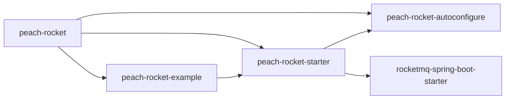
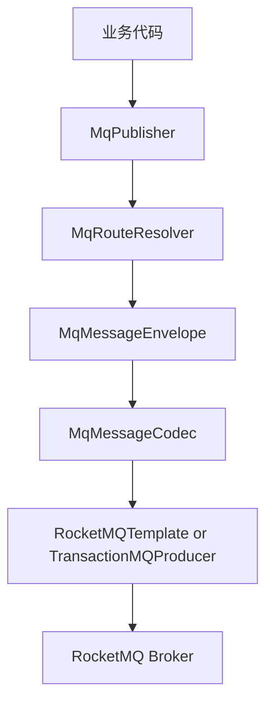
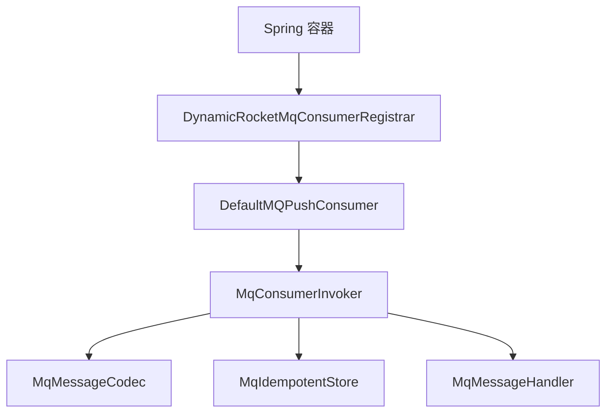
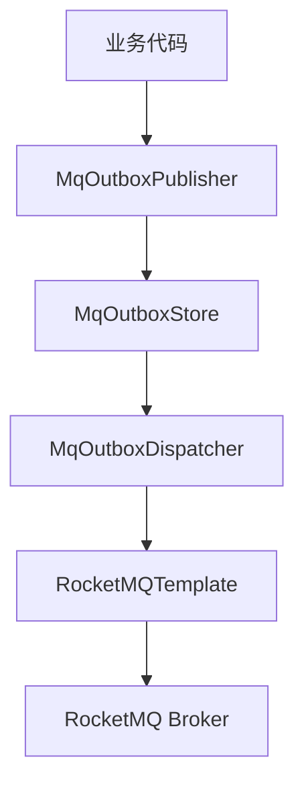

# Peach RocketMQ Starter

[English](README.en-US.md)

最后更新时间：2026/6/26  
维护人：Mr Shu  
适用版本：`peach-cloud 1.0.0-SNAPSHOT`、JDK 8、Spring Boot 2.7.13

## 1. 模块概览

`peach-rocket` 是 Peach 项目中的 RocketMQ 业务接入能力模块，目标是在保留 RocketMQ 原生概念的前提下，把业务项目里重复出现的发送、路由、序列化、动态消费者注册、消费幂等、事务消息、Topic 治理、可选 payload 加密、Outbox 可靠消息等能力封装为统一 API、默认实现和可覆盖的 SPI。

当前模块采用三段式结构：

- `peach-rocket-autoconfigure`：核心 API、自动配置、默认实现。
- `peach-rocket-starter`：业务项目实际引入的 starter 聚合模块。
- `peach-rocket-example`：最小可运行示例模块，同时承担 JDBC 幂等和 JDBC Outbox 的覆盖示例。

当前模块有一个明确调整：

- 核心 starter 不再内置 JDBC 幂等和 JDBC Outbox 的默认实现。
- JDBC 相关实现已经移动到 `example` 模块。
- 如果业务项目需要 JDBC 版本，应参考 `example` 中通过 `@Bean` 覆盖 SPI 的做法接入。

该模块当前不负责这些内容：

- 不部署 RocketMQ NameServer 或 Broker。
- 不提供 RocketMQ 管理控制台。
- 不替代 `rocketmq.*` 原生连接配置。
- 不默认开启 Topic 自动创建、payload 加密或 Outbox。
- 不把 tag 作为独立资源管理，因为 tag 本身不是 Broker 资源。

## 2. 模块职责边界

### 2.1 模块提供的能力

- 统一发送入口：`MqPublisher`
- 注解式事件路由：`@MqEvent`
- 注解式动态消费者：`@MqConsumer + MqMessageHandler<T>`
- 标准消息信封：`MqMessageEnvelope<T>`
- 路由解析与命名规范：`MqRouteResolver`、`RocketMqNaming`
- JSON 编解码与可选 payload 加密：`MqMessageCodec`
- 消费幂等：默认内存实现和幂等键解析 SPI
- 异常分类与错误处理：`MqExceptionClassifier`、`MqErrorHandler`
- 事务消息：`@MqTransaction + MqTransactionHandler<T>`
- Topic 自动创建：`RocketMqTopicAdmin`
- Outbox 可靠消息：默认内存实现、发布器、重放服务、调度器

### 2.2 模块不提供的能力

- 不对业务数据做最终一致性兜底，Outbox 只是通用机制，不替代业务状态机。
- 不内建 Redis 幂等、KMS 密钥管理、审计系统对接，这些都通过 SPI 覆盖。
- 不内建 JDBC 幂等和 JDBC Outbox 的生产默认实现，这部分已迁移为 example 中的覆盖示例。
- 不内建生产级控制台、告警中心、Dashboard。

## 3. 模块结构总览

下面的目录树只展示源码和文档相关内容，不包含 `target/` 这类构建产物。

```text
peach-middleware/peach-rocket/
├── .gitignore
├── pom.xml
├── README.md
├── README.en-US.md
├── peach-rocket-autoconfigure/
│   ├── pom.xml
│   └── src/main/
│       ├── java/com/peach/rocket/
│       │   ├── annotation/
│       │   ├── autoconfigure/
│       │   ├── codec/
│       │   ├── consumer/
│       │   ├── context/
│       │   ├── core/
│       │   ├── error/
│       │   ├── exception/
│       │   ├── idempotent/
│       │   ├── outbox/
│       │   ├── producer/
│       │   ├── route/
│       │   ├── security/
│       │   ├── support/
│       │   ├── topic/
│       │   └── transaction/
│       └── resources/
│           └── META-INF/spring/org.springframework.boot.autoconfigure.AutoConfiguration.imports
├── peach-rocket-starter/
│   └── pom.xml
└── peach-rocket-example/
    ├── pom.xml
    └── src/main/
        ├── java/com/peach/rocket/example/
        │   ├── config/
        │   │   └── jdbc/
        │   ├── consumer/
        │   ├── event/
        │   ├── runner/
        │   ├── service/
        │   └── PeachRocketExampleApplication.java
        └── resources/
            ├── application.yml
            └── schema/
                ├── mq_consume_record_mysql.sql
                └── mq_outbox_event_mysql.sql
```

## 4. 模块与文件职责

### 4.1 根目录文件

| 路径 | 作用 |
| --- | --- |
| `peach-middleware/peach-rocket/pom.xml` | `peach-rocket` 聚合 POM，声明 `autoconfigure`、`starter`、`example` 三个子模块。 |
| `peach-middleware/peach-rocket/README.md` | 中文主文档。 |
| `peach-middleware/peach-rocket/README.en-US.md` | 英文主文档，与中文文档保持结构和内容一致。 |
| `peach-middleware/peach-rocket/.gitignore` | 模块级忽略规则。 |

### 4.2 `peach-rocket-autoconfigure` 包结构与文件职责

#### `annotation`

| 文件 | 作用 |
| --- | --- |
| `MqEvent.java` | 声明业务事件的 `topic`、`tag`、`key`、`version`。 |
| `MqConsumer.java` | 声明动态消费者的订阅信息、消费模式、消息模型和幂等开关。 |
| `MqEncrypted.java` | 标记某类事件需要参与 payload 加密策略。 |
| `MqTransaction.java` | 声明事务消息处理器对应的 `topic` 和 `tag`。 |

#### `autoconfigure`

| 文件 | 作用 |
| --- | --- |
| `PeachRocketAutoConfigure.java` | 主自动配置入口，装配发送、消费、路由、编解码、幂等、异常、事务、Topic 管理等 Bean。 |
| `PeachRocketOutboxAutoConfigure.java` | Outbox 自动配置入口，按条件装配 Outbox 默认内存实现、发布器、重放服务、调度器。 |
| `PeachRocketProperties.java` | `peach.rocket.*` 配置属性模型，定义增强能力的全部有效配置项。 |

#### `codec`

| 文件 | 作用 |
| --- | --- |
| `MqMessageCodec.java` | 消息信封编解码 SPI。 |
| `JacksonMqMessageCodec.java` | 基于 Jackson 的标准信封 JSON 编解码实现。 |
| `SecureJacksonMqMessageCodec.java` | 在标准 JSON 编解码基础上增加 payload 加密与解密能力。 |

#### `consumer`

| 文件 | 作用 |
| --- | --- |
| `DynamicRocketMqConsumerRegistrar.java` | 扫描 `MqMessageHandler` Bean，并根据 `@MqConsumer` 动态注册原生 `DefaultMQPushConsumer`。 |
| `MqConsumerInvoker.java` | 统一消费执行入口，负责反序列化、上下文构建、幂等判断、业务回调、异常分类和日志。 |

#### `context`

| 文件 | 作用 |
| --- | --- |
| `DefaultMqHeaderResolver.java` | 统一整理业务侧传入的消息头。 |

#### `core`

| 文件 | 作用 |
| --- | --- |
| `MqPublisher.java` | 统一发送 API，提供同步、异步、单向、顺序、延迟、事务发送入口。 |
| `MqSendOptions.java` | 单次发送覆盖参数，如 `topic`、`tag`、`key`、`timeoutMillis`、`headers`、`delay`。 |
| `MqSendResult.java` | 统一发送结果模型。 |
| `MqDelay.java` | 延迟消息参数模型，支持时长和 RocketMQ delay level。 |
| `MqMessageEnvelope.java` | 标准消息信封，封装消息元数据、headers、payload、加密标识。 |
| `MqMessageHandler.java` | 业务消费接口。 |
| `MqConsumeContext.java` | 消费上下文，暴露消息 ID、topic、tag、key、headers 和重试次数。 |
| `MqConsumeMode.java` | 并发消费 / 顺序消费枚举。 |
| `MqMessageModel.java` | 集群消费 / 广播消费枚举。 |
| `MqLocalTransactionState.java` | 事务消息本地事务状态枚举。 |
| `MqTransactionHandler.java` | 事务消息本地事务执行与回查 SPI。 |

#### `error`

| 文件 | 作用 |
| --- | --- |
| `MqFailureAction.java` | 消费失败处理动作枚举，当前为 `RETRY` / `SKIP`。 |
| `MqExceptionClassifier.java` | 消费异常分类 SPI。 |
| `DefaultMqExceptionClassifier.java` | 默认异常分类器，当前默认重试。 |
| `MqErrorHandler.java` | 消费异常处理 SPI。 |
| `DefaultMqErrorHandler.java` | 默认错误处理器，记录结构化错误日志。 |

#### `exception`

| 文件 | 作用 |
| --- | --- |
| `MqException.java` | 模块统一运行时异常类型。 |

#### `idempotent`

| 文件 | 作用 |
| --- | --- |
| `MqIdempotentContext.java` | 幂等上下文模型。 |
| `MqIdempotentStore.java` | 幂等存储 SPI。 |
| `MqIdempotentKeyResolver.java` | 幂等键解析 SPI。 |
| `DefaultMqIdempotentKeyResolver.java` | 默认幂等键解析器。 |
| `InMemoryMqIdempotentStore.java` | 内存幂等实现，适合开发和单实例测试。 |

#### `outbox`

| 文件 | 作用 |
| --- | --- |
| `MqOutboxStatus.java` | Outbox 消息状态枚举。 |
| `MqOutboxEvent.java` | Outbox 事件实体。 |
| `MqOutboxStore.java` | Outbox 存储 SPI。 |
| `MqOutboxPublisher.java` | Outbox 发布入口 SPI。 |
| `MqOutboxReplayService.java` | Outbox 失败消息重放服务 SPI。 |
| `InMemoryMqOutboxStore.java` | 内存 Outbox 存储实现。 |
| `DefaultMqOutboxPublisher.java` | 默认 Outbox 发布器，把标准消息信封写入 Outbox。 |
| `DefaultMqOutboxReplayService.java` | 默认失败消息重放服务。 |
| `MqOutboxDispatcher.java` | Outbox 调度器，定时扫描并补偿发送消息。 |

#### `producer`

| 文件 | 作用 |
| --- | --- |
| `RocketMqPublisher.java` | 基于 `RocketMQTemplate` 的发送适配器，是 `MqPublisher` 默认实现。 |

#### `route`

| 文件 | 作用 |
| --- | --- |
| `MqRoute.java` | 发送路由模型。 |
| `MqRouteResolver.java` | 路由解析 SPI。 |
| `AnnotationMqRouteResolver.java` | 基于 `@MqEvent` 和 `MqSendOptions` 的默认路由解析器。 |

#### `security`

| 文件 | 作用 |
| --- | --- |
| `MqKeyProvider.java` | 密钥提供 SPI。 |
| `MqEncryptionPolicy.java` | 加密策略 SPI。 |
| `MqPayloadEncryptor.java` | payload 加密器 SPI。 |
| `MqEncryptionContext.java` | 加密上下文模型。 |
| `MqEncryptionResult.java` | 加密结果模型。 |
| `ConfigMqKeyProvider.java` | 基于配置属性读取密钥的默认密钥提供者。 |
| `ConfigurableMqEncryptionPolicy.java` | 基于配置和 `@MqEncrypted` 的默认加密策略。 |
| `AesGcmMqPayloadEncryptor.java` | 基于 AES-GCM 的默认加密器。 |

#### `support`

| 文件 | 作用 |
| --- | --- |
| `RocketMqNaming.java` | topic / consumer group 命名规范工具。 |

#### `topic`

| 文件 | 作用 |
| --- | --- |
| `RocketMqTopicAdmin.java` | Topic 自动创建器，只处理 topic，不处理 tag。 |

#### `transaction`

| 文件 | 作用 |
| --- | --- |
| `RocketMqTransactionMessageProducer.java` | 基于原生 `TransactionMQProducer` 的事务消息生产者。 |

### 4.3 `peach-rocket-autoconfigure` 资源文件

| 文件 | 作用 |
| --- | --- |
| `META-INF/spring/org.springframework.boot.autoconfigure.AutoConfiguration.imports` | Spring Boot 2.7 自动配置入口声明。 |

### 4.4 `peach-rocket-starter`

| 文件 | 作用 |
| --- | --- |
| `peach-rocket-starter/pom.xml` | 对业务项目暴露的 starter，仅聚合 `peach-rocket-autoconfigure` 与 `rocketmq-spring-boot-starter`。 |

说明：该模块本身几乎没有源码，这是典型 starter 的做法，目的是让业务接入依赖尽量简单。

### 4.5 `peach-rocket-example` 包结构与文件职责

#### `config`

| 文件 | 作用 |
| --- | --- |
| `config/ExampleJdbcRocketConfiguration.java` | 当示例应用中存在 `JdbcTemplate` 时，通过 `@Bean` 覆盖默认的内存幂等和内存 Outbox。 |
| `config/jdbc/ExampleJdbcMqIdempotentStore.java` | 示例专用 JDBC 幂等实现，演示如何在业务项目里自定义 `MqIdempotentStore`。 |
| `config/jdbc/ExampleJdbcMqOutboxStore.java` | 示例专用 JDBC Outbox 实现，演示如何在业务项目里自定义 `MqOutboxStore`。 |

#### `event`

| 文件 | 作用 |
| --- | --- |
| `event/OrderCreatedEvent.java` | 示例订单创建事件，演示 `@MqEvent` 用法。 |
| `event/OrderPaidEvent.java` | 示例订单支付事件，演示 `@MqEvent` 用法。 |

#### `consumer`

| 文件 | 作用 |
| --- | --- |
| `consumer/OrderCreatedConsumer.java` | 订单创建事件消费者。 |
| `consumer/OrderPaidConsumer.java` | 订单支付事件消费者。 |

#### `service / runner / root`

| 文件 | 作用 |
| --- | --- |
| `service/OrderService.java` | 示例发送服务，演示同步、异步、顺序、延迟消息发送。 |
| `runner/PeachRocketDemoRunner.java` | 示例启动 Runner，按开关自动发送演示消息。 |
| `PeachRocketExampleApplication.java` | 示例应用启动类。 |
| `resources/application.yml` | 示例模块启动配置。 |
| `resources/schema/mq_consume_record_mysql.sql` | 示例 JDBC 幂等表建表脚本。 |
| `resources/schema/mq_outbox_event_mysql.sql` | 示例 JDBC Outbox 表建表脚本。 |

说明：example 模块现在不仅展示基础消息能力，也承担 JDBC 覆盖示例，因此业务项目如果要落 JDBC 版本，可以直接参考这里的 `@Bean` 覆盖方式。

## 5. Maven 结构与依赖关系

### 5.1 模块依赖关系



### 5.2 版本基线

| 项目 | 版本 |
| --- | --- |
| JDK | 1.8 |
| Spring Boot | 2.7.13 |
| RocketMQ Spring Boot Starter | 2.2.3 |
| RocketMQ Client / Common / Remoting / Tools | 5.3.2 |

## 6. 核心架构

### 6.1 发送链路



### 6.2 动态消费链路



### 6.3 Outbox 链路



## 7. 快速接入

### 7.1 引入依赖

```xml
<dependency>
    <groupId>com.peach</groupId>
    <artifactId>peach-rocket-starter</artifactId>
</dependency>
```

### 7.2 最小配置

```yaml
rocketmq:
  name-server: 127.0.0.1:9876
  producer:
    group: order-service-producer

peach:
  rocket:
    namespace: dev
    app-name: order-service
    naming:
      topic-prefix: biz
      topic-separator: '-'
    consumer:
      dynamic-register: true
```

### 7.3 最小发送示例

```java
@Resource
private MqPublisher mqPublisher;

mqPublisher.publish(event);
mqPublisher.publishAsync(event);
mqPublisher.publishOrderly(event, String.valueOf(event.getOrderId()));
mqPublisher.publishDelay(event, MqDelay.duration(Duration.ofSeconds(10)));
```

### 7.4 最小消费示例

```java
@Slf4j
@Component
@MqConsumer(topic = "order", tag = "paid", consumerGroup = "order-service-order-paid")
public class OrderPaidConsumer implements MqMessageHandler<OrderPaidEvent> {

    @Override
    public void handle(OrderPaidEvent message, MqConsumeContext context) {
        log.info("order paid. orderId={} messageId={}", message.getOrderId(), context.getMessageId());
    }
}
```

## 8. 最终完整配置清单

下面是当前版本真正仍然生效的完整配置清单。只要不在这个列表里的 `peach.rocket.*` 配置，都不应该再继续使用。

### 8.1 `rocketmq.*` 原生配置

这些配置不属于 Peach Rocket 自己定义，但业务项目接入时通常至少会用到：

| 配置项 | 说明 |
| --- | --- |
| `rocketmq.name-server` | RocketMQ NameServer 地址。 |
| `rocketmq.producer.group` | RocketMQ 原生生产者组。 |

### 8.2 `peach.rocket` 根配置

| 配置项 | 默认值 | 说明 |
| --- | --- | --- |
| `peach.rocket.enabled` | `true` | 是否启用 Peach Rocket 自动配置。 |
| `peach.rocket.namespace` | `default` | 环境或业务域命名空间。 |
| `peach.rocket.app-name` | `application` | 当前应用名称，会写入消息信封。 |

### 8.3 `peach.rocket.producer`

| 配置项 | 默认值 | 说明 |
| --- | --- | --- |
| `peach.rocket.producer.default-timeout` | `3s` | 默认发送超时时间。 |

### 8.4 `peach.rocket.consumer`

| 配置项 | 默认值 | 说明 |
| --- | --- | --- |
| `peach.rocket.consumer.enable-idempotent` | `true` | 是否启用消费幂等保护。 |
| `peach.rocket.consumer.idempotent-expire` | `24h` | 幂等记录有效期。 |
| `peach.rocket.consumer.dynamic-register` | `true` | 是否启用 `@MqConsumer` 动态注册。 |
| `peach.rocket.consumer.consume-thread-min` | `1` | 原生消费者最小线程数。 |
| `peach.rocket.consumer.consume-thread-max` | `20` | 原生消费者最大线程数。 |

### 8.5 `peach.rocket.naming`

| 配置项 | 默认值 | 说明 |
| --- | --- | --- |
| `peach.rocket.naming.topic-prefix` | `biz` | topic 业务前缀。 |
| `peach.rocket.naming.group-prefix` | `cg` | consumer group 前缀预留字段。 |
| `peach.rocket.naming.topic-separator` | `-` | topic 命名片段分隔符。 |
| `peach.rocket.naming.auto-prefix-env` | `true` | 是否自动拼接真实 topic。 |

### 8.6 `peach.rocket.security`

| 配置项 | 默认值 | 说明 |
| --- | --- | --- |
| `peach.rocket.security.enabled` | `false` | 是否启用安全增强。 |
| `peach.rocket.security.encrypt-payload` | `false` | 是否默认对全部 payload 加密。 |
| `peach.rocket.security.algorithm` | `AES_GCM` | 默认加密算法。 |
| `peach.rocket.security.key-id` | `default` | 默认密钥标识。 |
| `peach.rocket.security.key` | 空 | 默认密钥内容。 |
| `peach.rocket.security.base64-key` | `false` | 密钥是否按 Base64 解码。 |
| `peach.rocket.security.encrypt-topics` | 空列表 | 需要加密的真实 topic 白名单。 |

### 8.7 `peach.rocket.transaction`

| 配置项 | 默认值 | 说明 |
| --- | --- | --- |
| `peach.rocket.transaction.enabled` | `true` | 是否启用事务消息能力。 |
| `peach.rocket.transaction.producer-group` | `peach-rocket-transaction-producer` | 事务消息生产者组。 |

### 8.8 `peach.rocket.topic`

| 配置项 | 默认值 | 说明 |
| --- | --- | --- |
| `peach.rocket.topic.auto-create` | `false` | 是否启用 topic 自动创建。 |
| `peach.rocket.topic.read-queue-nums` | `4` | 默认读队列数。 |
| `peach.rocket.topic.write-queue-nums` | `4` | 默认写队列数。 |
| `peach.rocket.topic.include-consumer-topics` | `true` | 是否从 `@MqConsumer` 收集 topic。 |
| `peach.rocket.topic.include-transaction-topics` | `true` | 是否从 `@MqTransaction` 收集 topic。 |
| `peach.rocket.topic.topics` | 空列表 | 显式追加需要创建的 topic 列表。 |

### 8.9 `peach.rocket.outbox`

| 配置项 | 默认值 | 说明 |
| --- | --- | --- |
| `peach.rocket.outbox.enabled` | `false` | 是否启用 Outbox。 |
| `peach.rocket.outbox.batch-size` | `50` | 单批扫描和发送数量。 |
| `peach.rocket.outbox.scan-interval-ms` | `2000` | Outbox 调度扫描间隔。 |

### 8.10 `example.rocket`

example 模块当前只保留一个演示开关：

| 配置项 | 默认值 | 说明 |
| --- | --- | --- |
| `example.rocket.demo.enabled` | `true` | 是否在示例应用启动后自动发送演示消息。 |

## 9. 关键能力说明

### 9.1 注解路由与命名规范

- `@MqEvent` 决定默认 `topic`、`tag`、`key`。
- `MqSendOptions` 可覆盖单次发送的路由。
- `AnnotationMqRouteResolver` 先取 `MqSendOptions`，再回退 `@MqEvent`。
- 当 `auto-prefix-env=true` 时，业务 topic `order` 会被规范化为 `dev-biz-order` 这种真实 topic。
- `key` 支持 `#orderId` 这类表达式写法。

### 9.2 标准消息信封

所有发送都会构造成 `MqMessageEnvelope<T>`，其中包括：

- `messageId`
- `topic`
- `tag`
- `key`
- `producerApp`
- `payloadType`
- `version`
- `headers`
- `payload`
- `createdAt`
- 加密相关标志和元数据

### 9.3 动态消费者注册

只要某个 Bean：

- 实现 `MqMessageHandler<T>`
- 标注 `@MqConsumer`

那么 `DynamicRocketMqConsumerRegistrar` 会在应用启动后创建并启动对应的 `DefaultMQPushConsumer`。业务侧不需要再写 RocketMQ Spring 原生的消费者注解。

### 9.4 消费幂等

当前 starter 默认实现只有：

- `InMemoryMqIdempotentStore`

如果业务项目需要 JDBC 幂等，请参考 example 模块里的：

- `ExampleJdbcRocketConfiguration`
- `ExampleJdbcMqIdempotentStore`

通过显式声明 `MqIdempotentStore` Bean 覆盖默认实现。

### 9.5 Payload 加密

当前默认实现：

- 密钥提供：`ConfigMqKeyProvider`
- 加密策略：`ConfigurableMqEncryptionPolicy`
- 加密算法：`AesGcmMqPayloadEncryptor`

触发条件：

- `peach.rocket.security.encrypt-payload=true`
- 或者消息类带 `@MqEncrypted`
- 或者消息真实 topic 在 `encrypt-topics` 白名单中

### 9.6 事务消息

事务消息能力由 `RocketMqTransactionMessageProducer` 提供，业务通过：

- `@MqTransaction`
- `MqTransactionHandler<T>`
- `MqPublisher.publishTransaction(...)`

完成本地事务执行和事务回查。

### 9.7 Topic 自动创建

`RocketMqTopicAdmin` 会按条件在应用启动后收集 topic 来源：

- `peach.rocket.topic.topics`
- `@MqConsumer`
- `@MqTransaction`

然后调用 RocketMQ 管理 API 创建或更新 topic。该能力只适合开发、测试或平台约束明确的环境，生产环境建议关闭。

### 9.8 Outbox 可靠消息

当前 starter 默认能力包括：

- `MqOutboxPublisher`
- `InMemoryMqOutboxStore`
- `MqOutboxDispatcher`
- `MqOutboxReplayService`

如果业务项目需要 JDBC Outbox，请参考 example 模块里的：

- `ExampleJdbcRocketConfiguration`
- `ExampleJdbcMqOutboxStore`

通过显式声明 `MqOutboxStore` Bean 覆盖默认实现。

## 10. 自动装配说明

自动装配入口文件：

```text
peach-rocket-autoconfigure/src/main/resources/META-INF/spring/org.springframework.boot.autoconfigure.AutoConfiguration.imports
```

注册类：

```text
com.peach.rocket.autoconfigure.PeachRocketAutoConfigure
com.peach.rocket.autoconfigure.PeachRocketOutboxAutoConfigure
```

### 10.1 `PeachRocketAutoConfigure` 默认 Bean

| Bean | 默认实现 | 生效条件 |
| --- | --- | --- |
| `MqKeyProvider` | `ConfigMqKeyProvider` | `peach.rocket.security.enabled=true` |
| `MqPayloadEncryptor` | `AesGcmMqPayloadEncryptor` | `peach.rocket.security.enabled=true` |
| `MqEncryptionPolicy` | `ConfigurableMqEncryptionPolicy` | `peach.rocket.security.enabled=true` |
| `MqMessageCodec` | `JacksonMqMessageCodec` / `SecureJacksonMqMessageCodec` | 自动判断是否启用安全能力 |
| `MqRouteResolver` | `AnnotationMqRouteResolver` | 默认 |
| `DefaultMqHeaderResolver` | `DefaultMqHeaderResolver` | 默认 |
| `MqIdempotentStore` | `InMemoryMqIdempotentStore` | 默认 |
| `MqIdempotentKeyResolver` | `DefaultMqIdempotentKeyResolver` | 默认 |
| `MqErrorHandler` | `DefaultMqErrorHandler` | 默认 |
| `MqExceptionClassifier` | `DefaultMqExceptionClassifier` | 默认 |
| `MqConsumerInvoker` | `MqConsumerInvoker` | 默认 |
| `DynamicRocketMqConsumerRegistrar` | `DynamicRocketMqConsumerRegistrar` | `dynamic-register=true` |
| `RocketMqTopicAdmin` | `RocketMqTopicAdmin` | `topic.auto-create=true` |
| `RocketMqTransactionMessageProducer` | `RocketMqTransactionMessageProducer` | `transaction.enabled=true` 且存在事务处理器 |
| `MqPublisher` | `RocketMqPublisher` | 默认 |

### 10.2 `PeachRocketOutboxAutoConfigure` 默认 Bean

| Bean | 默认实现 | 生效条件 |
| --- | --- | --- |
| `MqOutboxStore` | `InMemoryMqOutboxStore` | `outbox.enabled=true` |
| `MqOutboxPublisher` | `DefaultMqOutboxPublisher` | 存在 `MqOutboxStore` |
| `MqOutboxDispatcher` | `MqOutboxDispatcher` | 存在 `MqOutboxStore` 和 `RocketMQTemplate` |
| `MqOutboxReplayService` | `DefaultMqOutboxReplayService` | 存在 `MqOutboxStore` |

## 11. 扩展点清单

下面这些点都支持业务侧通过声明同类型 Bean 进行覆盖：

| SPI / 类型 | 作用 |
| --- | --- |
| `MqRouteResolver` | 自定义 topic/tag/key 解析策略 |
| `MqMessageCodec` | 自定义消息编解码格式 |
| `MqPayloadEncryptor` | 自定义加密算法 |
| `MqEncryptionPolicy` | 自定义加密触发规则 |
| `MqKeyProvider` | 接入 KMS、配置中心或外部密钥服务 |
| `MqIdempotentStore` | 接入 Redis、JDBC、数据库状态机或业务唯一约束 |
| `MqIdempotentKeyResolver` | 自定义幂等键生成方式 |
| `MqErrorHandler` | 接入审计、告警、可观测平台 |
| `MqExceptionClassifier` | 控制异常是否重试 |
| `MqOutboxStore` | 自定义 Outbox 持久化与调度模型 |

## 12. 示例模块说明

示例模块路径：

```text
peach-middleware/peach-rocket/peach-rocket-example
```

当前示例实际覆盖范围：

- `OrderCreatedEvent` / `OrderPaidEvent`
- 同步发送
- 异步发送
- 顺序发送
- 延迟发送
- 动态消费者注册
- JDBC 幂等覆盖示例
- JDBC Outbox 覆盖示例
- 示例启动 Runner 和最小配置

JDBC 覆盖方式示意：

```java
@Bean
public MqIdempotentStore exampleJdbcMqIdempotentStore(JdbcTemplate jdbcTemplate) {
    return new ExampleJdbcMqIdempotentStore(jdbcTemplate);
}

@Bean
public MqOutboxStore exampleJdbcMqOutboxStore(JdbcTemplate jdbcTemplate) {
    return new ExampleJdbcMqOutboxStore(jdbcTemplate);
}
```

这也是推荐的业务接入方式：

- starter 保留通用默认实现。
- 业务项目按需通过 `@Bean` 覆盖成 JDBC、Redis 或其他实现。

## 13. 构建与验证

模块级构建命令：

```bash
mvn -f "peach-middleware/peach-rocket/pom.xml" -DskipTests package
```

本次改造已验证：

- `peach-rocket` 聚合模块可以单独成功构建
- Peach 后端风格检查脚本对 `peach-middleware/peach-rocket` 结果为 `Errors: 0`、`Warnings: 0`

说明：整仓 `mvn -pl peach-middleware/peach-rocket -am` 会先受其他模块现有 POM 问题影响，这不属于 `peach-rocket` 自身的编译失败。

## 14. 排障指南

| 现象 | 检查点 |
| --- | --- |
| `MqPublisher` 未注入 | 确认引入的是 `peach-rocket-starter`，且容器中存在 `RocketMQTemplate`。 |
| `@MqConsumer` 未生效 | 检查业务类是否实现 `MqMessageHandler<T>`，是否被 Spring 扫描，`dynamic-register` 是否启用。 |
| 发送 topic 不符合预期 | 检查 `namespace`、`topic-prefix`、`topic-separator`、`auto-prefix-env` 和 `MqSendOptions` 是否覆盖默认值。 |
| 幂等没有生效 | 检查 `enable-idempotent`、消费者注解里的 `idempotent`、以及当前是否通过 `@Bean` 覆盖了 `MqIdempotentStore`。 |
| 需要 JDBC 幂等 | 参考 example 中的 `ExampleJdbcRocketConfiguration` 与 `resources/schema/mq_consume_record_mysql.sql`。 |
| payload 解密失败 | 检查 `key-id`、`key`、`base64-key`、算法和发送端/消费端配置是否一致。 |
| 事务消息发送失败 | 检查 `transaction.enabled`、`producer-group`、以及是否存在匹配 `topic/tag` 的事务处理器。 |
| Topic 自动创建失败 | 检查 NameServer/Broker 连通性、RocketMQ admin 权限，以及 `rocketmq-tools` 依赖是否可用。 |
| Outbox 不发送 | 检查 `outbox.enabled`、调度日志、RocketMQ 连通性，以及是否通过 `@Bean` 覆盖了合适的 `MqOutboxStore`。 |
| 需要 JDBC Outbox | 参考 example 中的 `ExampleJdbcRocketConfiguration` 与 `resources/schema/mq_outbox_event_mysql.sql`。 |

## 15. 当前限制与后续建议

当前限制：

- example 目前还没有把事务消息和加密也演示成完整业务样例。
- JDBC 覆盖示例是最小可用版本，复杂生产场景仍建议业务侧按自身模型扩展。
- 文档已经整合为单篇 README，但如果后续能力继续扩展，建议继续保留本 README 作为总述，再按需拆到 `docs/`。

后续建议：

- 为 example 增补事务消息和加密消息的完整示例类。
- 如果生产环境需要 Redis 幂等，新增基于 `peach-redis` 的 `MqIdempotentStore` 示例实现。
- 如果生产环境需要更强的 Outbox 调度治理，新增带抢占、退避和审计字段的业务实现。
