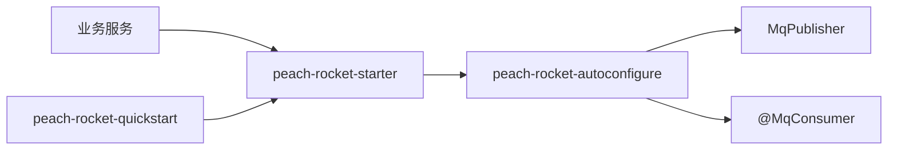

# peach-rocket

[English](README.en-US.md) | 中文

`peach-rocket` 是 RocketMQ 业务接入 starter，提供统一发送、事件路由、动态消费者、消费幂等、异常处理、事务消息、Topic 管理、payload 加密和 Outbox 可靠消息能力。

`peach-rocket-starter` 会聚合 RocketMQ Spring Boot 与 Topic Admin 运行时依赖；业务模块不需要重复声明 `rocketmq-spring-boot-starter` 或 `rocketmq-tools`。仅直接依赖 autoconfigure 时，RocketMQ 客户端或管理类缺失会使相关自动配置安全退场，但这种方式不作为业务接入入口。

## 结构

| 子模块 | 职责 |
| --- | --- |
| `peach-rocket-autoconfigure` | 核心 API、自动配置、默认实现和 SPI |
| `peach-rocket-starter` | 对业务模块暴露的 starter |
| `peach-rocket-quickstart` | 订单发布-消费、顺序发布与内存幂等能力样例 |



## 核心对象

| 对象 | 说明 |
| --- | --- |
| `MqPublisher` | 统一发送入口 |
| `@MqEvent` | 事件 topic、tag、key、version 路由声明 |
| `@MqConsumer` | 动态消费者声明 |
| `MqMessageHandler<T>` | 消费处理接口 |
| `MqConsumeContext` | 消费上下文 |
| `MqSendOptions` | 单次发送覆盖参数 |
| `MqTransactionHandler<T>` / `@MqTransaction` | 事务消息处理 |
| `MqIdempotentStore` | 消费幂等 SPI |
| `MqOutboxStore` | Outbox 存储 SPI |
| `MqPayloadEncryptor`、`MqEncryptionPolicy`、`MqKeyProvider` | payload 加密 SPI |
| `MqTraceContextPropagator` | 可选的 MQ 链路上下文传播 SPI |

## 接入

```xml
<dependency>
    <groupId>com.peach</groupId>
    <artifactId>peach-rocket-starter</artifactId>
</dependency>
```

配置基线：

```yaml
rocketmq:
  name-server: 127.0.0.1:9876
  producer:
    group: order-service-producer

peach:
  rocket:
    enabled: true
    namespace: dev
    app-name: order-service
    naming:
      topic-prefix: biz
      topic-separator: "-"
      auto-prefix-env: true
    consumer:
      dynamic-register: true
      enable-idempotent: true
    topic:
      auto-create: false
    outbox:
      enabled: false
```

## 发送与消费

```java
@MqEvent(topic = "order", tag = "created", key = "#orderId")
public class OrderCreatedEvent {
    private String orderId;
}

@Service
@RequiredArgsConstructor
public class OrderEventPublisher {

    private final MqPublisher mqPublisher;

    public void publish(OrderCreatedEvent event) {
        mqPublisher.publish(event);
    }
}
```

```java
@Component
@MqConsumer(topic = "order", tag = "created", consumerGroup = "order-created-consumer")
public class OrderCreatedConsumer implements MqMessageHandler<OrderCreatedEvent> {
    @Override
    public void handle(OrderCreatedEvent message, MqConsumeContext context) {
        // handle message
    }
}
```

## SPI 覆盖

- 路由：`MqRouteResolver`，默认基于注解解析。
- 编解码：`MqMessageCodec`。
- 幂等：`MqIdempotentStore`、`MqIdempotentKeyResolver`。
- 错误处理：`MqErrorHandler`、`MqExceptionClassifier`。
- 加密：`MqKeyProvider`、`MqPayloadEncryptor`、`MqEncryptionPolicy`。
- Outbox：`MqOutboxStore`、`MqOutboxPublisher`、`MqOutboxReplayService`。
- 链路上下文：`MqTraceContextPropagator`；未接入 Tracing 时默认使用空实现。

生产环境优先通过 `@Bean` 覆盖内存幂等、内存 Outbox 等默认实现。

## Quick Start

[`peach-rocket-quickstart`](./peach-rocket-quickstart/) 用进程内 `MqPublisher` 跑通订单闭环（`web-application-type: none`），不连接外部 NameServer / Broker。

- 能力样例：
  - **发布-消费**：`MqPublisher.publish` 订单创建事件，按 `@MqEvent` / `@MqConsumer` 的 topic+tag 同步投递给 Handler
  - **顺序发布**：`publishOrderly` 使用稳定 `orderId` 作为 `shardingKey`，再投递给 paid 消费者
  - **消费幂等**：starter 默认 `InMemoryMqIdempotentStore`，同一键 `tryStart + markSuccess` 后再次 `tryStart` 被拒绝
- 启动后 `RocketDemoRunner` 依次执行；关闭演示：`quickstart.rocket.demo.enabled=false`
- 事务消息 / Outbox / Broker 队列级顺序需要真实 RocketMQ，不在本样例覆盖
- 运行：`mvn -pl peach-middleware/peach-rocket/peach-rocket-quickstart -am spring-boot:run`
- 测试：`mvn -pl peach-middleware/peach-rocket/peach-rocket-quickstart -am test`

Quickstart 将 `peach.rocket.enabled` 设为 `false` 并排除 `RocketMQAutoConfiguration`，避免启动期连接 Broker。业务接入仍按上方配置开启 starter。

## 生产边界

- 默认内存幂等和内存 Outbox 只适合开发或单实例测试。
- 生产环境不要开启无治理的 Topic 自动创建。
- 顺序消息必须提供稳定的 `shardingKey`。
- Outbox 是可靠投递机制，不替代业务最终一致性状态机。
- 失败重试可能重复调用外部系统，消费者必须具备幂等语义。
- RocketMQ NameServer、Broker 和控制台不由本模块部署。
- 引入 `peach-observability-starter` 后，标准 Trace Context 会自动写入消息头，消费端恢复父上下文并创建 Consumer Span；不要在业务代码手工设置 `traceparent`。

## 构建与验证

```bash
mvn -f "peach-middleware/peach-rocket/pom.xml" test
mvn -f "peach-middleware/peach-rocket/pom.xml" clean package -DskipTests -Pdevelopment
```

## 排障指南

| 现象 | 检查点 | 处理方式 |
| --- | --- | --- |
| `MqPublisher` 未注入 | 是否引入 `peach-rocket-starter`；`peach.rocket.enabled` 是否开启 | 检查依赖和自动配置条件 |
| 消费者未注册 | `@MqConsumer` Bean 是否被扫描；`dynamic-register` 是否开启 | 检查包扫描和配置 |
| 重复消费 | 幂等 key 是否稳定；幂等存储是否生产可用 | 覆盖 `MqIdempotentStore` |
| 事务消息不回查 | `@MqTransaction` 和 `MqTransactionHandler` 是否匹配 | 检查事务处理器注册 |
| Outbox 堆积 | dispatcher 是否运行；存储状态是否可更新 | 检查 `MqOutboxStore` 和调度日志 |
| 启动提示缺少 `RocketMQTemplate` | 是否只传递了 autoconfigure、最终运行包是否包含 RocketMQ Spring | 使用 `peach-rocket-starter` 并重新构建最终应用 |
| 开启 Topic 自动创建后缺少 `DefaultMQAdminExt` | 最终运行包是否包含 `rocketmq-tools` | 升级并使用最新 `peach-rocket-starter`，重新构建最终应用 |

## 项目约定

- 后端文档统一遵循当前 peach-cloud 基线：Java 21、Spring Boot 3.5.4、Spring Cloud 2025.0.0、Spring Cloud Alibaba 2025.0.0.0。
- 前端文档仅适用于 peach-cloud-front，该目录是独立的 Vue 3 + Vite + TypeScript 工程，不属于 Maven reactor。
- 源码、脚本、SQL 和 Markdown 均保持 UTF-8 无 BOM；不要把 target/、.flattened-pom.xml、依赖缓存或 IDE 文件写入源码结构。
- README 中的命令、类名、配置项和示例必须能从当前仓库验证；不得写入真实密钥、token、私钥、生产密码、签名 URL 或完整敏感报文。
