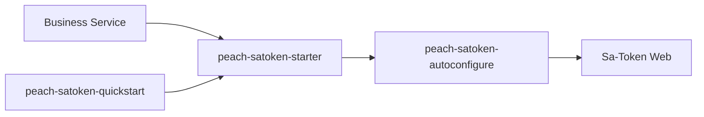

# peach-satoken

English | [中文](README.md)

`peach-satoken` packages Peach Cloud's Sa-Token Web and internal Same-Token integration. Business services use `peach-satoken-starter` as the shared authentication foundation.

## Structure

| Module | Responsibility |
| --- | --- |
| `peach-satoken-autoconfigure` | Sa-Token Web/Same-Token configuration and auto-configuration |
| `peach-satoken-starter` | Business integration dependency entry point |
| `peach-satoken-quickstart` | Minimal Web login/auth/session verification |



## Quick Start

The example lives in [`peach-satoken-quickstart`](./peach-satoken-quickstart/). Business login, permission data, and the upstream Same-Token source remain owned by real services. The QuickStart uses an in-memory token store and does not require Redis.

| Item | Detail |
| --- | --- |
| Capability samples | **Login**: `POST /auth/login` returns a token; **Authorize**: `GET /api/profile` with the token; **Reject**: missing token or access after logout returns 401 |
| Runner | `SaTokenDemoRunner` calls the local HTTP endpoints (Web context required); disable with `quickstart.satoken.demo.enabled=false` |
| Minimal config | `peach.satoken.dao.enabled=false` (in-memory token); demo account under `quickstart.satoken.demo.*` |
| Port | `18084` |
| Prerequisites | No Redis |

```bash
mvn -f peach-middleware/peach-satoken/peach-satoken-quickstart/pom.xml spring-boot:run
mvn -f peach-middleware/peach-satoken/peach-satoken-quickstart/pom.xml test
```

Override the demo password with `PEACH_SATOKEN_DEMO_PASSWORD`. Do not store production secrets.

## Boundaries

- Login and user role/organization/permission data remain owned by the authentication domain; the starter is not the permission-data source of truth.
- Same-Token constrains internal service-call identity and does not replace business API authorization.
- Tokens, Same-Token values, passwords and sensitive authentication payloads must not enter logs or examples.
- Gateway and business-service responsibilities remain separate: ingress authentication/coarse filtering and final business authorization cannot replace one another.
- Sa-Token must run inside a Web request context. QuickStart tests use MockMvc + `RANDOM_PORT`; do not call `StpUtil` without a Web context.
