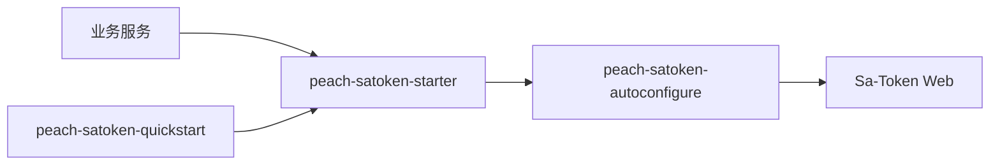

# peach-satoken

[English](README.en-US.md) | 中文

`peach-satoken` 封装 Peach Cloud 的 Sa-Token Web 与内部 Same-Token 接入能力。业务服务通过 `peach-satoken-starter` 使用统一认证基础设施。

## 结构

| 模块 | 职责 |
| --- | --- |
| `peach-satoken-autoconfigure` | Sa-Token Web/Same-Token 配置与自动装配 |
| `peach-satoken-starter` | 业务接入依赖入口 |
| `peach-satoken-quickstart` | 最小 Web 登录/鉴权/会话验证 |



## Quick Start

示例位于 [`peach-satoken-quickstart`](./peach-satoken-quickstart/)。业务登录、权限数据和 Same-Token 上游来源仍由实际服务提供。QuickStart 使用内存 Token，不依赖 Redis。

| 项 | 说明 |
| --- | --- |
| 能力样例 | **登录**：`POST /auth/login` 返回 token；**鉴权**：带 token 访问 `GET /api/profile`；**拒绝**：无 token 或登出后再访问返回 401 |
| Runner | `SaTokenDemoRunner` 通过本机 HTTP 演示（保证 Web 上下文）；关闭演示：`quickstart.satoken.demo.enabled=false` |
| 最小配置 | `peach.satoken.dao.enabled=false`（内存 Token）；开发占位账号 `quickstart.satoken.demo.*` |
| 端口 | `18084` |
| 前置 | 无需 Redis |

```bash
mvn -f peach-middleware/peach-satoken/peach-satoken-quickstart/pom.xml spring-boot:run
mvn -f peach-middleware/peach-satoken/peach-satoken-quickstart/pom.xml test
```

开发占位密码可通过 `PEACH_SATOKEN_DEMO_PASSWORD` 覆盖；禁止写入生产密钥。

## 边界

- 登录、用户角色/机构/权限数据仍由业务认证域负责，Starter 不成为权限数据事实源。
- Same-Token 用于内部服务调用身份约束，不替代业务级 API 权限校验。
- Token、Same-Token、密码和认证响应中的敏感字段不得写入日志或示例。
- 网关和业务服务的职责必须区分：入口认证/粗粒度拦截与业务侧最终授权不能相互替代。
- Sa-Token 必须在 Web 请求上下文中调用；QuickStart 测试使用 MockMvc + `RANDOM_PORT`，禁止在无 Web 上下文中直接调用 `StpUtil`。
